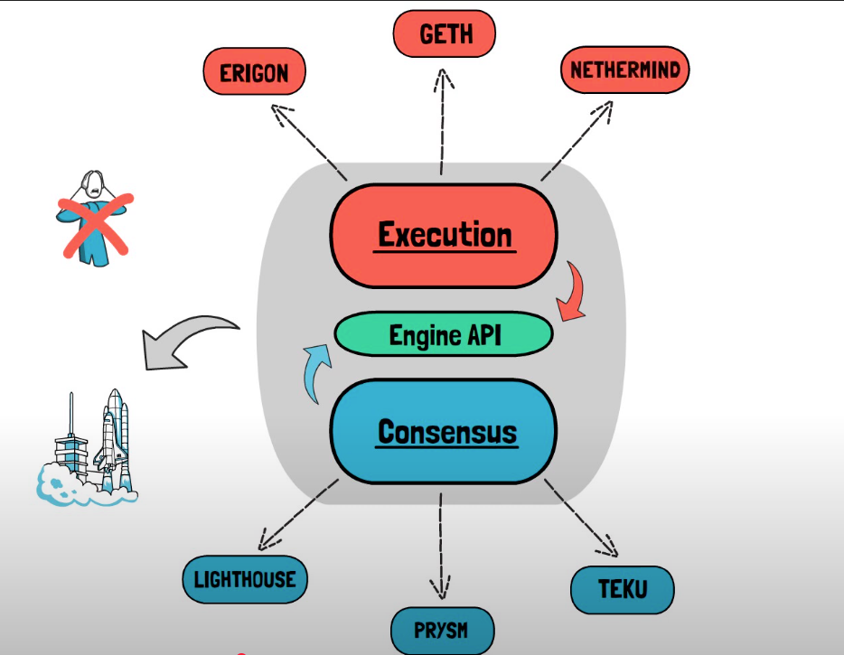
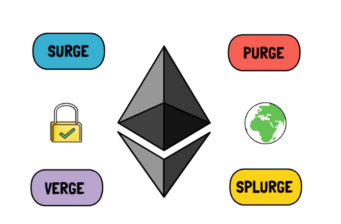

# ERC-20 Ownable Token with Mint & Burn

## Overview

This smart contract implements a fungible token with:

- Full ERC-20 standard interface (EIP-20)
- Ownership control (via `Ownable`)
- Minting (only owner can mint new tokens)
- Burning (token holders or approved spenders can burn tokens)

---

## Specification

### Interfaces & Behavior

| Component | Methods / Events | Access Control / Requirements |
|----------|-------------------|-------------------------------|
| **ERC-20** | `totalSupply()`, `balanceOf(address)`, `transfer(address,uint256)`, `approve(address,uint256)`, `transferFrom(address,address,uint256)`, `allowance(address,uint256)` <br> Events: `Transfer`, `Approval` | Standard checks: non‐zero addresses, sufficient balances, allowance logic, etc. |
| **Ownable** | `owner()`, `onlyOwner` modifier, `transferOwnership(address)`, optionally `renounceOwnership()` | Owner set at deployment; only owner can call owner-only functions. |
| **Minting** | `mint(address to, uint256 amount)` | Only owner can mint; cannot mint to zero address; total supply increases. |
| **Burning** | `burn(uint256 amount)`, `burnFrom(address account, uint256 amount)` | Holders (or approved spender) can burn; sufficient balance; total supply decreases. |

---

## Security & Constraints

- Prevent operations involving zero address.
- Ensure safe arithmetic (overflow/underflow) — use Solidity ≥0.8 or libraries.
- Emit appropriate events: for `mint`, a `Transfer(0x0, to, amount)`; for `burn`, `Transfer(account, 0x0, amount)`.
- Ownership functions protected via `onlyOwner`.
- Do not allow minting/burning beyond expected logical constraints (if any).

---

## Out of Scope

Unless added explicitly, the contract **does not include**:

- Role-based access beyond single owner (e.g. separate minters or burners)
- Supply cap / maximum supply
- Pausing or freezing transfers
- Permit / meta-transaction support
- Snapshot / voting / staking or other extensions

---

## Example Implementation Snippet

```solidity
// SPDX-License-Identifier: MIT
pragma solidity ^0.8.0;

import "@openzeppelin/contracts/token/ERC20/ERC20.sol";
import "@openzeppelin/contracts/access/Ownable.sol";

contract MyToken is ERC20, Ownable {
    constructor(string memory name, string memory symbol) ERC20(name, symbol) {
        // optionally initial minting
    }

    function mint(address to, uint256 amount) public onlyOwner {
        _mint(to, amount);
    }

    function burn(uint256 amount) public {
        _burn(msg.sender, amount);
    }

    function burnFrom(address account, uint256 amount) public {
        uint256 currentAllowance = allowance(account, msg.sender);
        require(currentAllowance >= amount, "ERC20: burn amount exceeds allowance");
        _approve(account, msg.sender, currentAllowance - amount);
        _burn(account, amount);
    }
}
```

## ERC-20 Required Functions & Events

Below are the *mandatory* methods and events a contract must implement to comply with ERC-20. (Optional metadata functions are not listed here.)

---

### ⚙ Required Methods

| Function | Signature | Visibility & Return Types | Purpose / Requirements |
|---|---|---|--------------------------|
| `totalSupply()` | `function totalSupply() public view returns (uint256)` | view, returns total number of tokens in existence.  [oai_citation:0‡Ethereum Improvement Proposals](https://eips.ethereum.org/EIPS/eip-20?utm_source=chatgpt.com) |
| `balanceOf(address _owner)` | `function balanceOf(address _owner) public view returns (uint256 balance)` | view, returns the balance of `_owner`.  [oai_citation:1‡Ethereum Improvement Proposals](https://eips.ethereum.org/EIPS/eip-20?utm_source=chatgpt.com) |
| `transfer(address _to, uint256 _value)` | `function transfer(address _to, uint256 _value) public returns (bool success)` | non-view; transfers `_value` tokens from caller to `_to`. Must emit `Transfer`. Should fail (revert) on insufficient balance. Zero-value transfers allowed.  [oai_citation:2‡Ethereum Improvement Proposals](https://eips.ethereum.org/EIPS/eip-20?utm_source=chatgpt.com) |
| `approve(address _spender, uint256 _value)` | `function approve(address _spender, uint256 _value) public returns (bool success)` | non-view; caller sets allowance for `_spender` to spend up to `_value` from caller’s account. Should emit `Approval`. May overwrite existing allowance.  [oai_citation:3‡Ethereum Improvement Proposals](https://eips.ethereum.org/EIPS/eip-20?utm_source=chatgpt.com) |
| `allowance(address _owner, address _spender)` | `function allowance(address _owner, address _spender) public view returns (uint256 remaining)` | view; returns remaining amount `_spender` is allowed to withdraw from `_owner`.  [oai_citation:4‡Ethereum Improvement Proposals](https://eips.ethereum.org/EIPS/eip-20?utm_source=chatgpt.com) |
| `transferFrom(address _from, address _to, uint256 _value)` | `function transferFrom(address _from, address _to, uint256 _value) public returns (bool success)` | non-view; moves `_value` tokens from `_from` to `_to`, where the caller has sufficient allowance. Must reduce allowance accordingly. Must emit `Transfer`. Zero value transfers allowed.  [oai_citation:5‡Ethereum Improvement Proposals](https://eips.ethereum.org/EIPS/eip-20?utm_source=chatgpt.com) |

---

### 🗳 Required Events

| Event | Signature | When to Emit |
|---|-------------------------------|---------------------------|
| `Transfer(address indexed _from, address indexed _to, uint256 _value)` | `event Transfer(address indexed _from, address indexed _to, uint256 _value)` | Emit on any token transfer. Also emit when tokens are *minted* (i.e. from address `0x0` → recipient) or *burned* (recipient is `0x0`). Zero value transfers still emit.  [oai_citation:6‡Ethereum Improvement Proposals](https://eips.ethereum.org/EIPS/eip-20?utm_source=chatgpt.com) |
| `Approval(address indexed _owner, address indexed _spender, uint256 _value)` | `event Approval(address indexed _owner, address indexed _spender, uint256 _value)` | Emit whenever `approve(...)` is called successfully.  [oai_citation:7‡Ethereum Improvement Proposals](https://eips.ethereum.org/EIPS/eip-20?utm_source=chatgpt.com) |

---

### 📌 Notes & Requirements

- All token transfers (including `transfer(...)` and `transferFrom(...)`) must emit the `Transfer` event.  [oai_citation:8‡Ethereum Improvement Proposals](https://eips.ethereum.org/EIPS/eip-20?utm_source=chatgpt.com)
- Transfers of **0** value are allowed and must still emit the `Transfer` event.  [oai_citation:9‡Ethereum Improvement Proposals](https://eips.ethereum.org/EIPS/eip-20?utm_source=chatgpt.com)
- `approve(...)` must emit `Approval` event.  [oai_citation:10‡Ethereum Improvement Proposals](https://eips.ethereum.org/EIPS/eip-20?utm_source=chatgpt.com)
- `transferFrom` must enforce that the caller has been approved; allowance must be reduced.  [oai_citation:11‡Ethereum Improvement Proposals](https://eips.ethereum.org/EIPS/eip-20?utm_source=chatgpt.com)

---

## Who Pays Gas When You Invoke a Non-View Function via MetaMask

1. You send a transaction (non-view function call) through MetaMask.
2. **You** (the sender) pay for the gas.
3. The payment comes from your wallet address (the account you used in MetaMask).
4. MetaMask will show you an estimate for the gas cost before you confirm.
5. If your wallet doesn’t have enough ETH to cover the gas, the transaction will fail or won’t be sent.

---

## 🔍 Additional Details

- Gas cost = `gasUsed × gasPrice` (or with EIP-1559: base fee + priority tip).
- Even if the transaction fails (e.g. reverts), you still pay gas for the work done up until the failure.
- The recipient of a transaction doesn’t pay the gas. The gas always comes from the sender (unless some contract logic reimburses them later, but that’s extra).  


Here’s a walkthrough (in Markdown) of the Ethereum send() / transaction signing & lifecycle process, covering who signs what, what RPC does, validation, rejection, etc.

⸻


# Ethereum Transaction Send / Signing Lifecycle

Below is a step-by-step of what happens when you invoke a non-view function (via `send()`), from signing to inclusion in a block.

---

## 1. What parties sign

- **Externally Owned Account (EOA)**: the user who owns the private key of the sending address signs the transaction.
- **No other party signs** by default. Only the private key of the sender is used to generate a digital signature over the transaction contents (nonce, gas limit, gas price / tip, to, value, data, chain ID).  [oai_citation:0‡Medium](https://medium.com/mycrypto/the-magic-of-digital-signatures-on-ethereum-98fe184dc9c7?utm_source=chatgpt.com)
- If using a wallet such as MetaMask, the wallet UI will ask you to confirm, then uses your private key (or hardware wallet) to sign.

---

## 2. Will RPC be invoked?

- After signing **locally**, the signed transaction is sent (broadcast) to the Ethereum network via an RPC endpoint (e.g. via `eth_sendRawTransaction`) or via a provider (like Infura, Alchemy, or your own node).  [oai_citation:1‡Alchemy](https://www.alchemy.com/docs/how-ethereum-transactions-work?utm_source=chatgpt.com)
- The local client (wallet / Web3 library) constructs the transaction object, signs it, serializes it (often RLP encoding), then invokes an RPC call to submit the signed transaction.  [oai_citation:2‡Medium](https://medium.com/mycrypto/the-magic-of-digital-signatures-on-ethereum-98fe184dc9c7?utm_source=chatgpt.com)

---

## 3. What party is accountable for validation and rejection

- **Sender / wallet**: ensures correct parameters (e.g. nonce, gas limit, to address, data) before signing. If something is invalid, the client/wallet may reject locally (e.g. bad address, insufficient funds).
- **RPC node / Ethereum node/network**: once submitted, the node that receives the transaction validates it. Validation includes checks like:
  - Is signature valid?
  - Is the nonce correct (not replaying or too low)?
  - Does the sender have enough ETH for gas + value?
  - Is gas price acceptable?
  - Is chainId correct?
- If any validation fails, the transaction is rejected (not included in the mempool). The node may reply with an error.

---

## 4. Lifecycle of the transaction (if it passes initial validation)

1. **Mempool / Transaction Pool**
  - After passing basic checks, the transaction sits in the node’s transaction pool (mempool) waiting to be picked up by a miner (or validator, depending on consensus).

2. **Mining / Including in Block**
  - A miner/validator picks the transaction (often based on gas price / tip) and includes it in a new block.

3. **Block Propagation**
  - The block is propagated to other nodes.

4. **State Execution**
  - When the block is executed, the transaction executes the specified function on contract (non-view), updating state. Gas is consumed.

5. **Receipt**
  - A transaction receipt is generated, containing status (success/failure), gas used, logs/events, etc.

6. **Confirmation**
  - Once the block is part of the canonical chain and many more blocks are built on top, the transaction is considered confirmed.

---

## ✅ Summary

- The **sender** signs with their private key.
- RPC is invoked to submit the signed transaction.
- Nodes validate and can reject if invalid.
- If valid, the tx enters the mempool, then eventually included in a block, executed, and you get a receipt.

---

✅ **How to determine the correct nonce**

You generally fetch the nonce by querying the network for the account’s transaction count. Key options:

- **Using RPC / provider**:  
  Call `eth_getTransactionCount(address, "pending")` — this returns confirmed + pending transactions (so you can safely use the next nonce).

- **Alternative**:  
  Call `eth_getTransactionCount(address, "latest")` (only confirmed ones), but this may cause collisions if you have pending txs.

---

⚠️ **What to watch out for**

- **Pending transactions**:  
  If you already submitted txs that aren’t mined, their nonces are reserved. Using the same nonce will cause conflicts or rejection.

- **Skipping nonces**:  
  If you pick a nonce higher than current + 1 (leaving gaps), that tx stays pending until all prior nonces are mined. Later txs are blocked until gaps are filled.

- **Concurrency**:  
  If multiple processes/wallets send txs from the same address, they may race for nonces. Use shared state or locking to avoid clashes.

---

🛠 **Best practices**

- Always query `"pending"` nonce from your provider before creating a tx.
- If you have a queue of txs, track nonces locally so you know what’s reserved even if not confirmed.
- If a tx is stuck or pending too long, replace it by submitting a new tx with the same nonce but higher gas (**replace-by-fee**).
- Use libraries / SDKs / frameworks that help with nonce management (e.g. **ethers.js**, **web3.js**, **Nethereum**, or backend systems) to avoid manual handling.  

### SDKs
- ethers.js
- web3.js
- Nethereum

When you send a transaction to a node (RPC / full node), it goes through several validation steps **before** being accepted into the node’s mempool. These checks help ensure that bad/fraudulent transactions are filtered out.

Here are key checks / steps:

| Step                  | What is Checked                                                                                   | Why It Protects                                                  |
|-----------------------|--------------------------------------------------------------------------------------------------|------------------------------------------------------------------|
| **Signature correctness** | The transaction must have a valid digital signature matching the claimed sender address.          | Prevents spoofing / forging of transactions.                     |
| **Nonce correctness**     | The nonce must be ≥ the account’s current nonce; usually from `eth_getTransactionCount(..., "pending")`. | Avoids replay or out-of-order or duplicate tx issues.            |
| **Balance check**         | Sender must have enough ETH to cover `value + gas limit × gas price` (or max fees).                | Prevents transactions that would overspend.                      |
| **Gas limit & fees**      | Gas limit must be valid; fees must meet minimal rules, etc. If gas price is too low, some nodes may decline or drop. | Prevents spam / DoS with extremely underpriced txs.               |
| **Basic format checks**   | RLP-serialization correctness; fields present; chain ID matching; etc.                           | Ensures malformed txs are rejected early.                        |
| **Consensus rules**       | The tx must not violate protocol or client-specific rules (e.g. EIP rules, gas rules, chain rules). | Prevents invalid state transitions.                              |

---

✅ **Transaction Flow & Types**

- Only valid transactions enter your node’s mempool and get broadcast.
- Other nodes revalidate them during propagation.

---

🔹 **Types of Ethereum transactions**
- **Contract deployment**
- **Human-to-human (EOA → EOA)**
- **Contract-to-contract (internal)**
- **Hybrid (e.g., DeFi use)**

---

🔹 **Transaction states**
- **Pooled / Mined / Dropped / Replaced**
- **Canceled** – replacement that cancels the original
- **Confirmed** – mined & included on-chain
- **EOA** – between Externally Owned Accounts
- **Failed** – attempted but didn’t succeed
- **Internal** – smart contract ↔ smart contract
- **Private** – sent directly to a miner (skip mempool)
- **Stuck** – pending, can’t be mined
- **Type 0** – legacy (pre-EIP-1559)
- **Type 2** – EIP-1559 format  

### 🔌 Ethereum Wire Protocol: Full Node Tasks

All full nodes on Ethereum have three basic tasks with the **Wire protocol**:

1. **Synchronization** – Download and verify headers, blocks, and state to stay in sync.
2. **Block Propagation** – Share new blocks with peers for fast global consensus.
3. **Pending Transaction Propagation** – Gossip unconfirmed transactions from mempool to peers.  

Ethereum transactions are propagated across a decentralized Peer-to-Peer (P2P) network using protocols like RLPx and the Wire Protocol, ensuring block producers and validators can find pending transactions in the mempool. Nodes discover each other using bootnodes and establish secure connections using the RPLx protocol. They synchronize state, blocks, and pooled transactions using the Wire protocol

Nodes propagate transactions by signaling new transactions via the NewPooledTransactionHashes message, or peers can query for these transactions using the GetPooledTransactions message. Since The Merge, the consensus layer client receives, pre-validates, and passes blocks to the execution layer client, which executes transactions, validates the block’s state, and sends the validated block back to the consensus layer client for broadcasting. 


### Our actors in Ethereum’s transaction flow

---

⚡ **Front-running bots**
- Monitor the public mempool for profitable opportunities.
- When they see a big trade, they send their own tx with higher gas so it executes first.
- Example: You buy a token → bot buys before you → raises price → sells after (sandwich attack).

---

📊 **MEV searchers**
- MEV = *Maximal Extractable Value*.
- More advanced than simple bots: scan mempool or use private relays (e.g., Flashbots).
- Bundle profitable txs (arbitrage, liquidations, sandwiching) → submit to validators.
- Compete in an “MEV auction” by paying higher fees.

---

🧑‍⚖️ **Validators**
- Block proposers in Ethereum Proof-of-Stake.
- Decide which mempool txs (public/private) to include in blocks.
- Profit motive: maximize rewards via priority fees + MEV bundles.
- Can cooperate with searchers via MEV relays (e.g., Flashbots).

---

🔍 **Explorers**
- Tools like Etherscan to observe mempool and chain state.
- Show pending txs, gas prices, activity.
- Don’t seek profit directly but provide transparency that bots/searchers also use.

---

✅ **In short:**
- Front-running bots = simple opportunists.
- MEV searchers = advanced profit optimizers.
- Validators = decide final tx ordering/inclusion.
- Explorers = observers giving visibility.  

### Ethereum Transaction Types & EIP-1559
- Type 0 (Legacy): Transaction format from before EIP-1559. Uses a single `gasPrice` field. Still valid and accepted.
- Type 2 (EIP-1559): Introduced in the London hard fork. Uses `maxFeePerGas` + `maxPriorityFeePerGas` + base fee mechanics. Default/preferred now.
- Backwards compatibility: Legacy transactions continue to work even after EIP-1559. 

### 🔹 Full Node
- Stores full blockchain data (headers, blocks, state).
- Verifies all transactions and blocks against consensus rules.
- Relays valid txs/blocks across the p2p network.
- Does **not** create new blocks.

### 🔹 Miner (Proof-of-Work era, pre-Merge)
- A full node **plus** block production role.
- Used computational power (hashing) to solve puzzles.
- If successful, produced a block → earned block reward + fees.

### 🔹 Validator (Proof-of-Stake, post-Merge)
- A full node **plus** staking-based block proposer role.
- Selected randomly (weighted by stake) to propose/attest blocks.
- Earns rewards from priority fees, MEV, and issuance.

✅ In short:
- **Full node** = verifies & relays.
- **Miner (old)** / **Validator (current)** = full node + *block producer* role.  


### 🔹 How MEV Searchers Operate

1. **Transaction Monitoring**
  - Run their own Ethereum nodes or use private relay feeds.
  - Continuously scan pending txs in the public mempool.
  - Identify profitable patterns: arbitrage, liquidations, sandwich opportunities.

2. **Simulation**
  - Use custom bots to simulate “what if I insert my tx here?”
  - Run many simulations to estimate profit vs. cost (gas, risk).

3. **Bundling & Submission**
  - Craft bundles of transactions (their tx + victim tx + closing tx).
  - Submit via:
    - Public mempool (fast, higher gas to outbid others).
    - Private relays (e.g. **Flashbots**) → avoid leaking strategy to bots.

4. **Competition**
  - Multiple searchers compete in a “MEV auction.”
  - Offer higher **priority fees** or direct payments to validators.
  - Validator includes the most profitable bundle.

5. **Execution**
  - If chosen, their transactions execute in the exact order they planned.
  - Profit goes to the searcher; validator earns the tip.

---

### 🔹 Community & Communication
- **Searchers are organized** and often work semi-professionally.
- Public discussion happens in research forums (e.g., [Flashbots forum](https://collective.flashbots.net/)).
- Academic papers, GitHub repos, and blogs explain MEV strategies in theory.
- Anything like “special Discord channels” does exist, but they are **private, competitive, and not open to the public** — most professional MEV actors guard strategies closely.

✅ In short:  
MEV searchers are like **quant traders for Ethereum** → scanning txs, simulating outcomes, and competing to pay validators for profitable order flow.  


### 🔹 Private Relays in Ethereum

- **What they are**
  - Network services that let MEV searchers send transaction bundles **directly to validators**, skipping the public mempool.
  - Part of the *MEV-Boost* / PBS (Proposer-Builder Separation) ecosystem.

- **Why they exist**
  - Prevents strategies (arbitrage, liquidations, sandwiches) from being copied by other bots.
  - Reduces risk of front-running in the public mempool.
  - Lets validators earn more by receiving optimized bundles.

- **How they work**
  1. Searcher → submits bundle to **builder** (via private relay).
  2. Builder → constructs a block with most profitable tx ordering.
  3. Relay → forwards block proposal to validator.
  4. Validator → signs/attests block → includes on chain.

- **Examples**
  - Flashbots Relay (most known).
  - bloXroute, Eden, Manifold, others.

✅ In short:  
Private relays = **“private pipelines”** for transactions, used to protect MEV strategies and let validators choose the most profitable block proposals.  


### 🔍 References on MEV Auctions

- [Flashbots Auction (overview)](https://docs.flashbots.net/flashbots-auction/overview?utm_source=chatgpt.com) – Intro to Flashbots’ private relay auction system.
- [MEV Auction: Auctioning transaction ordering rights (MEVA)](https://ethresear.ch/t/mev-auction-auctioning-transaction-ordering-rights-as-a-solution-to-miner-extractable-value/6788?utm_source=chatgpt.com) – Ethresear.ch proposal for auctioning ordering rights.
- [Strategic Bidding Wars in MEV-Boost Auctions](https://arxiv.org/html/2312.14510v2?utm_source=chatgpt.com) – Game-theoretic analysis of builder/searcher competition.
- [MEV-SGX: A sealed bid MEV auction design](https://ethresear.ch/t/mev-sgx-a-sealed-bid-mev-auction-design/9677?utm_source=chatgpt.com) – Design using SGX for sealed bids.
- [A Note on Bundle Profit Maximization](https://angeris.github.io/papers/flashbots-mev.pdf?utm_source=chatgpt.com) – Formal description of bundles and bids.
- [MEV-Boost Auction dataset (Flashbots)](https://zenodo.org/records/15789978?utm_source=chatgpt.com) – Dataset of real block bids/auctions.
- [SoK: MEV Countermeasures: Theory and Practice](https://arxiv.org/abs/2212.05111?utm_source=chatgpt.com) – Survey of MEV auctions and mitigations.  


### 🔹 Base Staking Yield (Inflation-Only)

- **Where it comes from**
  - Ethereum issues new ETH as rewards to validators for duties:
    - Attestations (voting on correct blocks)
    - Sync committee participation
    - Proposing blocks

- **Rate depends on validator count**
  - The more validators there are, the more the total reward pool is split.
  - Each validator gets a smaller slice when participation grows.

- **Typical range**
  - With current validator set (~1M+ active validators), base inflation rewards = ~3–4% APR.
  - This excludes **execution-layer rewards** (priority fees + MEV).

- **Key point**
  - Inflation yield is the *guaranteed, protocol-level* reward.
  - Execution rewards (fees, MEV) sit **on top** and push APR higher (≈5–6% with MEV-Boost).  


### 🔹 Why Ethereum Blockspace Feels Scarce

1. **Bidding wars**
  - Open mempool = everyone competes on gas price.
  - Creates volatility, higher fees, and disadvantages for regular users.

2. **All-pay auction problem**
  - Even failed bids consume blockspace (reverted txs still included).
  - Bidders underprice to reduce risk, lowering validator revenue.
  - Artificial scarcity emerges.

3. **Limited bidding language**
  - `gasPrice` (Type 0) or simple fee bidding doesn’t allow fine ordering preferences.
  - Users resort to spamming or brute-force strategies.
  - Wastes blockspace and adds network load.

✅ In short: Blockspace is scarce not just because of technical limits, but also due to **inefficient auction design** in the public mempool.  

### 🔹 Execution vs. Consensus Clients
- **Execution client (e.g., Geth, Nethermind)**
  - Runs the EVM, processes transactions, updates balances and state.

- **Consensus client (beacon node, e.g., Prysm, Lighthouse)**
  - Runs Proof-of-Stake consensus.
  - Relies on the execution client for transaction validity and state.

---

### 🔹 When a block has a failed transaction
- The **execution payload** in the block contains all transactions.
- Execution client applies them sequentially:
  - **Reverted tx** → sender loses gas, no other state changes.
  - **Successful tx** → balances and contracts updated.

---

### 🔹 How the beacon node learns
1. Beacon node receives the new block from the proposer.
2. Forwards the **execution payload** to its paired execution client.
3. Execution client updates balances and state.
4. Beacon node checks that the resulting state matches the block’s root.

---

✅ **In short:**
- The **execution client** updates wallet balances.
- The **beacon node** only coordinates consensus and validates that the execution client’s result is correct.  


### 🔹 Ethereum’s Account Model
- Ethereum uses an **account-based model** (not UTXO like Bitcoin).
- Each account has:
  - **Address**
  - **Nonce**
  - **Balance**
  - **Storage root** (for contracts)
  - **Code hash** (for contracts)

---

### 🔹 World State
- The EL client maintains a global **world state** = mapping of all accounts → their balances and data.
- This state is stored in a **Merkle Patricia Trie (state trie)**.
- Root hash of the trie is included in every block header.

---

### 🔹 Syncing
- When you run an EL client:
  - It downloads blocks from peers.
  - Applies all transactions in order.
  - Updates the state trie after each block.
- Over time, the client reconstructs the **entire Ethereum state**.

---

### 🔹 Wallet visibility
- The client doesn’t need to “track” wallets individually.
- It just stores the entire state database (key-value store).
- If you query `eth_getBalance(address)`, the client looks up that address in its state trie.

---

✅ **In short:**  
An EL client “knows all wallets” because it maintains the **entire Ethereum state trie**, updated with every block. Every balance, nonce, and contract is part of this global state, not something the client has to “discover” one by one.  


### 🔹 Ethereum (ETH)
- **State storage:** Merkle Patricia Trie (MPT) → maps addresses → accounts (balance, nonce, storage, code).
- **Persistence:** Entire state is maintained *continuously* and updated with every block.
- **Size:** As of 2025, the Ethereum world state is hundreds of GBs (≈250–350 GB depending on pruning).
- **Lifetime:** Indefinite — state persists as long as accounts/contracts exist.

---

### 🔹 Ethereum Classic (ETC)
- **Same design as Ethereum** (before upgrades like Verkle tries are introduced).
- Uses the Merkle Patricia Trie for global state.
- **Size:** A bit smaller than ETH because of less activity and fewer contracts.
- **Lifetime:** Also indefinite — state grows with chain usage.

---

### 🔹 Bitcoin (BTC)
- **Different model:** UTXO (Unspent Transaction Output) set.
- No account trie — instead, it tracks all unspent outputs in a database (LevelDB/RocksDB).
- **Persistence:** UTXO set is updated every block, like Ethereum’s state.
- **Size:** Much smaller — ~10–15 GB today (since it only tracks spendable outputs, not contracts/storage).
- **Lifetime:** Indefinite, updated as long as Bitcoin runs.

---

✅ **In short:**
- ETH & ETC → use a **Merkle Patricia Trie** to store the full account-based world state, continuously updated, and now hundreds of GB in size.
- BTC → uses a **UTXO set** instead, stored in a database, smaller (~10–15 GB).
- In all cases, this state is kept *forever*, updated at each block, because it’s the reference for validating new transactions.  


### 🔹 Ethereum / Ethereum Classic State Model

- **Accounts:**  
  Two types:
  1. **Externally Owned Accounts (EOAs):** normal wallets (just balance + nonce).
  2. **Contract Accounts:** smart contracts (balance + code + *storage*).

- **Storage:**
  - Each contract account has its own persistent key-value store.
  - This storage is part of the world state, kept in the Merkle Patricia Trie.
  - Keys/values are 32-byte slots.

---

### 🔹 Solidity Example (your array case)
```solidity
uint256[] public myArray;
```
### 🔹 Storage Mapping in Solidity

- **`myArray.length`** → stored at a fixed slot.  
- **Elements (`myArray[0]`, `myArray[1]`, …)** → stored at derived slots (using `keccak256` hashing).  

When your contract runs, the **EVM reads/writes** these slots in the account’s storage.  

---

### 🔹 Key Point
- **Yes:** In Ethereum/ETC, “storage” is the persistent data space inside **contract accounts**.  
- **EOAs (human wallets):** no contract storage, only **balance + nonce**.  
- All of this lives inside the global **state trie**, so every node can validate and reproduce the same results.  

---

✅ **In short:**  
Arrays, mappings, and structs in Solidity → compiled into **storage slots** → stored in the contract account → persisted in the **state trie**.  

### 🔹 Coinbase Accounts

- **User accounts at Coinbase**
  - When you open a Coinbase account, they create a **custodial wallet** for you.
  - On-chain, this corresponds to an **Externally Owned Account (EOA)** controlled by Coinbase’s infrastructure, not directly by you.
  - Coinbase holds the private keys, you just interact via their app/API.

- **Contract accounts**
  - Coinbase doesn’t create contract accounts for you by default.
  - If you deploy a smart contract, *you* (or your app) would create that account on Ethereum, not Coinbase.

---

✅ **In short:**  
Coinbase user wallets are **EOAs**. They’re custodial EOAs, meaning Coinbase holds the keys. Contract accounts are separate and created only when you deploy smart contracts.  

### 🔹 MetaMask Accounts

- **EOAs only**
  - MetaMask generates **Externally Owned Accounts (EOAs)** for users.
  - You control these via your private key or seed phrase.
  - These EOAs can hold ETH/tokens, sign txs, and interact with smart contracts.

- **Contract accounts**
  - MetaMask does **not** create contract accounts automatically.
  - If you deploy a smart contract using MetaMask, *that action* creates a new **contract account** on Ethereum.
  - But the creation comes from your EOA sending a deployment transaction.

---

✅ **In short:**  
MetaMask = wallet for **EOAs**.  
Contract accounts exist only if you **deploy a contract** from your EOA.  

### 🔹 Create an Externally Owned Account (EOA)
- EOAs are just a **keypair** (private key + address).
- They are **not created on-chain** until they send or receive ETH/tokens.
- Typical API calls:
  - **web3.js / ethers.js**
    ```js
    // web3.js
    const account = web3.eth.accounts.create();
    console.log(account.address, account.privateKey);
    ```
    ```js
    // ethers.js
    const wallet = ethers.Wallet.createRandom();
    console.log(wallet.address, wallet.privateKey);
    ```
  - **JSON-RPC**
    - `personal_newAccount` (if node has the personal API enabled)

---

### 🔹 Create a Contract Account
- Contract accounts are created **on-chain** when an EOA sends a special transaction with `data` = compiled bytecode.
- Typical API calls:
  - **JSON-RPC**
    - `eth_sendTransaction` with a `data` field (no `to` address)
    ```json
    {
      "from": "0xYourEOA",
      "data": "0x6080604052...",   // contract bytecode
      "gas": "0x500000"
    }
    ```
  - **web3.js / ethers.js**
    ```js
    const contract = new web3.eth.Contract(abi);
    contract.deploy({ data: bytecode })
      .send({ from: account, gas: 5000000 });
    ```
    ```js
    const factory = new ethers.ContractFactory(abi, bytecode, wallet);
    const contract = await factory.deploy();
    ```

---

✅ **In short:**
- **EOA = keypair** → created locally via libraries (`accounts.create`, `Wallet.createRandom`, etc.), no transaction required.
- **Contract account = deployed contract** → created on-chain via `eth_sendTransaction` with `data = bytecode`.  


### 🔹 EOAs and the Ledger
- An **EOA is just a keypair** (address + private key).
- When you generate it locally (MetaMask, ethers.js, Coinbase internal systems), it doesn’t yet exist *on-chain*.
- The Ethereum ledger doesn’t pre-store “all possible addresses.”

---

### 🔹 How it receives assets
- Ethereum’s **world state** (state trie) is a mapping: `address → account data`.
- If an address has **never been used**, it simply isn’t present in the state trie.
- The **moment someone sends ETH/tokens to it**, the EL client:
  - Creates a new entry in the state trie for that address.
  - Initializes it with balance (and nonce = 0).

---

### 🔹 Key Point
- You don’t need to “register” an EOA on-chain before receiving assets.
- The address is deterministically derived from your keypair, so anyone can send to it.
- The ledger will “activate” the account when a transaction or transfer first touches it.

---

✅ **In short:**  
An EOA is “off-chain” until first use. Once ETH or a token is sent to it, the execution client creates an entry for it in the global state, and from then on, it’s part of the ledger.  

### 🔹 How Ethereum Addresses Are Derived

1. **Private key**
  - A random 256-bit number.
  - Must remain secret (controls the account).

2. **Public key**
  - Derived from the private key using Elliptic Curve Cryptography (secp256k1).
  - One-to-one relationship: every private key produces exactly one public key.

3. **Address**
  - Take the public key.
  - Hash it with `keccak256`.
  - Take the **last 20 bytes** → that’s your Ethereum address.
  - Example:
    ```
    address = keccak256(public_key)[12:]
    ```

---

### 🔹 Why it’s deterministic
- Given the same private key → always get the same public key → always get the same address.
- No central registry is needed.
- That’s why wallets like MetaMask or Coinbase can generate addresses offline and know they’ll work.

---

### 🔹 How others can send to it
- Once you know the address, you don’t need the private key to send assets there.
- Anyone can include that address in a transaction’s `to` field.
- When the first transfer happens, Ethereum clients add the address to the global state with its new balance.

---

✅ **In short:**  
An Ethereum address is just a deterministic hash of a keypair. Because it’s predictable and unique, it can receive ETH or tokens *even before it appears on-chain*.  

### 🔹 Block arrives
- The EL client receives a new block (with its transactions) from peers.
- Each transaction has a `from`, `to`, `value`, `gas`, and optional `data`.

---

### 🔹 Processing transactions
- For each tx, the client:
  1. **Checks sender (`from`)**
    - The account *must* already exist in the state trie (otherwise tx is invalid).
  2. **Checks recipient (`to`)**
    - If `to` exists → update its balance / run contract code.
    - If `to` does **not** exist and it’s not empty code → create a new account entry in the state trie.
      - Example: first time you send ETH to a fresh EOA.

---

### 🔹 Updating the global state trie
- If an address didn’t exist in the trie yet:
  - The client inserts a new entry (`balance = value`, `nonce = 0`, `code = empty`, `storage = empty`).
- The state root is recalculated after applying all transactions in the block.
- The block header includes this **new state root**, which every node checks to stay in sync.

---

### 🔹 Key Point
- EL clients don’t “pre-know” all addresses.
- They **dynamically add them** to the state trie the first time a tx touches them.
- That’s how a never-before-used EOA can suddenly hold ETH after its first incoming transfer.

✅ **In short:**  
When a block arrives, the EL client processes txs → if a `to` address isn’t in the trie yet, it **creates it on the fly** and updates the state accordingly.  


### 🔹 Why an EOA address is unique and deterministic
- **1 private key → 1 public key → 1 address**
  - Private key: random 256-bit number.
  - Public key: derived from private key using elliptic curve multiplication (secp256k1).
  - Address: `address = keccak256(public_key)[12:]` → last 20 bytes.

---

### 🔹 Key implications
- **Deterministic:** Same private key always yields the same address.
- **Unique:** The probability of two private keys giving the same address is astronomically small.
- **Trustless:** Anyone can generate an address offline, no central registry needed.
- **Receivable:** Others only need the 20-byte address, not the public or private key, to send ETH/tokens.

---

✅ **In short:**  
An EOA works because cryptography guarantees a *1-to-1 deterministic mapping* from private key → public key → address. That’s why an address can exist “off-chain” and still receive assets the first time it’s referenced in a block.  

### 🔹 Private Key
- A 256-bit secret number — must be kept hidden.
- **Used for:**
  - **Signing transactions** (ECDSA signatures).
  - Proving ownership of the account (you control the funds).
- Never shared; only the signature is broadcast.

---

### 🔹 Public Key
- Derived from the private key (via secp256k1 elliptic curve multiplication).
- **Used for:**
  - **Verifying signatures** → nodes confirm that a tx was signed by the right private key.
  - **Deriving the address** → `keccak256(public_key)[12:]`.
- Doesn’t need to be kept secret; anyone can know it.

---

### 🔹 Address
- Derived from the public key.
- **Used for:**
  - Receiving ETH/tokens.
  - Identifying accounts on-chain.
- Much shorter (20 bytes) so easier to handle than raw public keys.

---

✅ **In short:**
- **Private key = sign.**
- **Public key = verify.**
- **Address = receive.**  


### 🔹 Public Key
- **What it is:**
  - Mathematically derived from the private key (via elliptic curve multiplication).
  - A fixed identifier that corresponds to one private key.

- **Purpose:**
  - Used to **verify** signatures created with the private key.
  - Used to derive your **address** (`keccak256(public_key)[12:]`).

- **Properties:**
  - Can be shared openly.
  - Same every time (doesn’t change).

---

### 🔹 Signature
- **What it is:**
  - A cryptographic proof generated by applying the private key to some message (e.g., a transaction).
  - In Ethereum, this is an **ECDSA signature** (r, s, v values).

- **Purpose:**
  - Proves that the message/transaction came from the holder of the private key.
  - Allows others to check validity using only the public key.

- **Properties:**
  - Different every time, even if the same message is signed (because of randomization in the algorithm).
  - Only valid for the specific message signed.

---

✅ **In short:**
- **Public key** = a *static identifier* derived from the private key, used for verification.
- **Signature** = a *dynamic proof* generated with the private key, used to show authenticity of a specific message.  

### 🔹 Step 1 — You create the transaction
- You fill in:
  - `to` = your friend’s address
  - `value` = 1 ETH
  - `gas` + `maxFeePerGas`
- This unsigned transaction is just a piece of data.

---

### 🔹 Step 2 — MetaMask uses your private key
- MetaMask holds your **private key** (in the browser extension, encrypted with your password).
- It takes the unsigned tx data and runs **ECDSA signing** with your private key.
- Output = transaction + **signature (r, s, v)**.
- The private key **never leaves MetaMask**.

---

### 🔹 Step 3 — Transaction broadcast
- The signed transaction is sent to your connected **Execution Layer (EL) client** (e.g., Infura, Alchemy, or your own Geth).
- The client gossips it across the Ethereum p2p network (devp2p → eth/66 protocol).

---

### 🔹 Step 4 — How the EL verifies
When another EL client receives the tx:
1. **Recover public key** from the signature (possible because ECDSA allows key recovery).
2. Hash public key with `keccak256`, take last 20 bytes → reconstruct the **sender address**.
3. Check:
  - Does the sender exist in the state trie?
  - Does the sender have ≥ 1 ETH + gas fees?
  - Is the nonce correct?
  - Is the signature valid?

If all checks pass → tx is valid and goes to the mempool.

---

### 🔹 Step 5 — Block inclusion
- A validator eventually proposes a block.
- The EL executes your tx:
  - Deducts 1 ETH + gas from **your EOA balance**.
  - Increments your nonce.
  - Adds 1 ETH to your friend’s account (creating it in the trie if it didn’t exist yet).

---

✅ **In short:**
- **Private key**: signs the tx (in MetaMask).
- **Signature**: proves authenticity, lets EL recover your public key/address.
- **Public key**: never sent directly, only reconstructed from the signature.
- **Execution client**: verifies signature + state, then updates balances when block is mined.  

### 🔹 1. Proposer is chosen
- In Proof-of-Stake, the **beacon chain (Consensus Layer)** randomly selects a validator to propose the next block.
- That validator runs *both*:
  - A **Consensus Layer (CL) client** (e.g., Lighthouse, Prysm).
  - An **Execution Layer (EL) client** (e.g., Geth, Nethermind).

---

### 🔹 2. EL prepares the payload
- The validator’s **EL client** takes pending transactions from its **mempool**.
- It executes them in order, applying gas limits and validity checks.
- Result = **execution payload**:
  - List of transactions
  - Resulting state root
  - Receipts, logs, etc.

---

### 🔹 3. Handshake between EL and CL
- The **EL client** passes this execution payload to the validator’s **CL client** through the **Engine API** (`engine_getPayload`, `engine_newPayload`, etc.).
- CL client doesn’t execute txs — it just trusts EL for state.

---

### 🔹 4. Block is proposed
- The validator’s **CL client** wraps the execution payload into a beacon block.
- Broadcasts the block to other validators on the P2P network.

---

### 🔹 5. Other validators verify
- Peers’ **EL clients** re-execute the payload transactions to confirm the state root.
- Their **CL clients** check consensus rules (signatures, attestations).
- If all checks pass → block accepted.

---

✅ **In short:**
- The EL client *inside the validator’s own node* feeds transactions → execution payload → to the CL client.
- The CL client → proposes the block to the rest of the network.
- So the tx doesn’t “travel” to some remote staker — the validator *is* running EL+CL together.  

### 🔹 Normal flow (no MEV-Boost)
- Each validator runs its own **EL client** with a mempool.
- When selected to propose a block, it picks txs from *its own mempool* to build the block.

---

### 🔹 With MEV-Boost
- Validators **outsource block building** to external **block builders**.
- Flow:
  1. Searchers → send bundles of profitable txs to builders.
  2. Builders → construct candidate full blocks (using their own mempool + bundles).
  3. Builders → submit bids via **relays** to validators.
  4. Validator (via MEV-Boost middleware) → chooses the most profitable block proposal.

- The validator’s own EL client doesn’t build the block in this case — it just verifies the block is valid after the builder provides it.

---

### 🔹 Key point
- MEV-Boost **does not send txs directly into a validator’s mempool**.
- Instead, it bypasses the validator’s mempool entirely by letting **builders deliver ready-made blocks**.
- Validators pick between blocks (auctions), not transactions.

---

✅ **In short:**
- **Without MEV-Boost**: Validator’s mempool → block.
- **With MEV-Boost**: Builder’s mempool/bundles → block → validator.  


### 🔹 Execution Payload (simplified structure)

- **parentHash** – Hash of the parent execution block.
- **feeRecipient** – Address that receives transaction fees (validator’s chosen withdrawal address).
- **stateRoot** – Root of the state trie *after* applying all included transactions.
- **receiptsRoot** – Root of the receipts trie (logs/events for each tx).
- **logsBloom** – Bloom filter for quickly searching logs/events.
- **prevRandao** – Randomness for the block (from beacon chain).
- **blockNumber** – Height of the chain.
- **gasLimit / gasUsed** – Gas constraints for the block.
- **timestamp** – Unix time of the block.
- **baseFeePerGas** – Base fee from EIP-1559.
- **extraData** – Arbitrary data (set by proposer/builder).
- **transactions[]** – The full list of signed txs included.
- **withdrawals[]** – Withdrawals from validator balances (post-Shanghai/Capella).

---

### 🔹 Example (simplified JSON)

```json
{
  "parentHash": "0xabc123...",
  "feeRecipient": "0xdef456...",
  "stateRoot": "0x789abc...",
  "receiptsRoot": "0x456def...",
  "logsBloom": "0x00...ff",
  "blockNumber": 1928374,
  "gasLimit": 30000000,
  "gasUsed": 2893472,
  "timestamp": 1694451200,
  "baseFeePerGas": "0x34e62ce00",
  "transactions": [
    "0xf86c820...",
    "0xf87083..."
  ],
  "withdrawals": [
    { "index": 1, "validatorIndex": 12345, "address": "0xaaa...", "amount": 32000000000 }
  ]
}
```

### 🔹 Why miners went to Siberia
- PoW required massive energy, and electricity was the #1 cost.
- Regions with **cheap hydropower** (Siberia, Quebec, Iceland, parts of China) became mining hubs.
- Firms co-located their rigs near power stations to cut costs.

---

### 🔹 What happened after The Merge
- Ethereum (ETH) abandoned PoW completely → GPUs/ASICs for ETH became useless.
- Some miners tried to:
  - Switch to **Ethereum Classic (ETC)** or coins like **Ravencoin, Ergo**.
  - Repurpose GPUs for AI/ML workloads.
  - Sell hardware (big wave of used GPUs hit markets in 2022–23).
- Specialized ETH ASICs mostly became e-waste.

---

### 🔹 Today
- The **ETH PoW mining business is gone**.
- Bitcoin mining still thrives — and cheap electricity hubs are still relevant — but BTC is mined with specialized ASICs, not GPUs.
- Those Siberian operations that were ETH-only either pivoted to BTC/ETC, sold off, or shut down.

---

✅ **In short:**  
The “cheap hydropower farm in Siberia” strategy worked in the PoW era. After Ethereum’s Merge, ETH mining ended, so that business disappeared — only BTC and a few smaller PoW coins keep similar setups alive.  

### 🔹 Example of Profitable Transactions to Builders
- **Arbitrage:**  
  Buy token on Uniswap at 100, sell on Sushiswap at 102 → profit from price difference.
- **Liquidations:**  
  On Aave or Maker, liquidate an undercollateralized loan → get a liquidation bonus.
- **Sandwich attack:**  
  Detect a large buy order in mempool → place your buy just before, and sell just after, profiting from slippage.
- **Bundle:**  
  Searcher can package multiple txs together (buy + sell) to guarantee atomic profit if block includes both.

Builders receive these bundles and create blocks with maximum value for validators.

---

### 🔹 Who is a Searcher?
- **Searcher = profit seeker.**
- They run bots to scan the mempool or private relays for opportunities.
- Use custom simulation engines to test “what if my tx went here?” scenarios.
- Submit **bundles of profitable txs** to builders (via Flashbots or other relays).
- Compete against other searchers → whoever pays the highest tips to validators usually wins.

---

✅ **In short:**
- **Searcher = trader/algorithm/bot** that finds and bundles profitable opportunities.
- **Builder = block constructor** who takes txs (including from searchers) and assembles the most profitable block.
- Together they feed the MEV auction that validators pick from.  

### 🔹 Collateralized Lending (Aave / Maker)
- User deposits collateral (e.g., 10 ETH) and borrows stablecoins (e.g., 10,000 DAI).
- Protocol requires a **collateral ratio** (e.g., 150%).

---

### 🔹 When the loan goes underwater
- If ETH price drops, collateral may no longer meet the ratio.
- Example: 10 ETH @ $2,000 = $20,000 collateral → ratio = 200%.
- If ETH falls to $1,200 → $12,000 collateral, ratio = 120% (below 150%).
- Loan is now **undercollateralized**.

---

### 🔹 Liquidation process
1. Protocol marks the position as liquidatable.
2. **Searcher (liquidator)** sends a liquidation transaction.
  - Repays part/all of the borrower’s debt on their behalf.
3. In return:
  - Liquidator seizes borrower’s collateral at a discount (e.g., 5–10%).
  - That discount = **liquidation bonus**, pure profit for the liquidator.

---

### 🔹 Why it’s profitable
- Liquidators can instantly resell the collateral on DEXs.
- The “bonus” ensures bots/searchers race to liquidate risky positions.

---

✅ **In short:**  
Liquidations = buying collateral at a discount by paying off someone’s bad loan.  
Searchers/bots compete to grab these chances for a guaranteed profit.  

### 🔹 Case: Liquidation on Aave / Maker
- Borrower’s position falls below collateral ratio.
- Liquidator repays the borrower’s debt (partially or fully).
- In return, liquidator gets the borrower’s collateral **+ a small bonus**.

---

### 🔹 Does Aave/Maker lose money?
- **No, normally they don’t.**
  - The debt is repaid (by the liquidator).
  - The seized collateral covers the debt + the liquidation bonus.
  - Protocol remains solvent.

- **When risk appears:**
  - If the market moves **too fast** (e.g., ETH price crashes suddenly), collateral value might fall below debt + bonus.
  - In such cases, protocol’s insurance fund (e.g., Aave Safety Module, Maker’s Surplus Buffer) absorbs the shortfall.

---

### 🔹 Who bears the loss?
- **Normal liquidation:** borrower loses collateral, liquidator profits, protocol safe.
- **Extreme crash:** protocol’s backstop funds or governance tokens (AAVE/MKR) may be used to cover deficit.

---

✅ **In short:**
- In regular conditions → **Aave/Maker do not lose money** in liquidations.
- In extreme volatility → **losses are socialized** via insurance/backstop mechanisms.  


### 🔹 Aave
- All core contracts (LendingPool, Incentives, Governance, etc.) are deployed on Ethereum.
- Source code is published and verified on **Etherscan**.
- Repo: [github.com/aave/protocol-v2](https://github.com/aave/protocol-v2) (and v3).
- Governance decisions (risk parameters, asset listings) are made by **AAVE token holders** through on-chain governance.

---

### 🔹 MakerDAO
- Maker Protocol contracts (Vaults, Collateral, DAI Stablecoin, Liquidations) are also fully on-chain.
- Verified on **Etherscan**.
- Repo: [github.com/makerdao](https://github.com/makerdao).
- Governance (like stability fees, collateral ratios) decided by **MKR token holders** via public governance votes.

---

### 🔹 Why this matters
- Because contracts are public + immutable once deployed, users and searchers/liquidators can trust:
  - How collateralization is calculated.
  - How liquidations happen.
  - How governance parameters are applied.
- Protocol transparency = stronger trust, no hidden rules.

✅ **In short:**  
Yes — Aave and Maker publish their smart contracts openly, and loan governance (risk params, fees, collateral) is enforced by **on-chain code** plus token-holder governance.  

### 🔹 Ethereum (L1)
- Base blockchain network.
- Provides security, consensus, and settlement.
- Hosts smart contracts for apps like Aave, Maker, Uniswap, etc.

---

### 🔹 Aave
- A **lending protocol** deployed as smart contracts on Ethereum (and also on some L2s like Polygon, Arbitrum, Optimism).
- Not its own chain — it lives *on Ethereum or L2s*.

---

### 🔹 MakerDAO
- Protocol behind the **DAI stablecoin**.
- Runs entirely on Ethereum smart contracts.
- Uses governance via MKR token to set parameters.
- Also **not its own chain**.

---

✅ **In short:**
- **Ethereum = L1 blockchain.**
- **Aave & MakerDAO = applications/protocols built on Ethereum L1 (and some L2s).**
- They depend on Ethereum’s security, not their own consensus.  

### 🔹 What is Base?
- A **Layer 2 blockchain** built by Coinbase.
- Uses the **OP Stack** (same tech as Optimism).
- Secures itself by posting data/transactions back to Ethereum (L1).

---

### 🔹 Why it exists
- Cheaper & faster transactions than Ethereum mainnet.
- Fully compatible with the Ethereum Virtual Machine (EVM).
- Tightly integrated with Coinbase products → easy on/off ramps.

---

### 🔹 Key traits
- **Not an L1** → it inherits security from Ethereum.
- **Rollup**: executes transactions off-chain, then batches them to Ethereum.
- **Ecosystem**: DeFi, NFTs, on-chain apps — same as Ethereum, but lower gas.

---

✅ **In short:**  
**Base = Coinbase’s Ethereum Layer 2 (built with Optimism tech).**  
It’s not its own L1 like Ethereum or Solana — it’s an L2 rollup that depends on Ethereum for final security.  

### 🔹 Sequencers (in L2s like Base, Arbitrum, Optimism)
- Role: order transactions and create L2 blocks.
- They **do not** run MEV auctions like Ethereum validators.
- They send compressed transaction data back to Ethereum (L1) for finality.
- Today: centralized (often a single sequencer per rollup, run by the project team).
- Future: roadmap to decentralize sequencing and enable shared MEV auctions.

---

### 🔹 MEV Relays / Validators (Ethereum L1)
- **Validators**: chosen by Ethereum PoS to propose blocks.
- **MEV relays**: deliver block bundles (via MEV-Boost) to validators.
- This happens only on Ethereum L1, not inside Base/Arbitrum/Optimism (yet).

---

### 🔹 Key Difference
- **Sequencer** = transaction orderer in an L2.
- **Validator/Relay** = transaction/bundle orderer in Ethereum L1 MEV auctions.
- Base’s sequencer (run by Coinbase) decides tx order **within Base**, but Base still posts the results to Ethereum, where L1 validators enforce finality.

---

✅ **In short:**  
Coinbase’s Base sequencers are **not MEV relays or validators**. They are L2 ordering nodes. Ethereum L1 validators (with MEV relays) still decide the *final ordering at the base layer*.  

## 🔹 L2 Landscape (Explanation)

- **Polygon**
  - PoS sidechain (separate validators), now expanding with zkEVM.
  - ✅ Strength: broad ecosystem, enterprise adoption.
  - ❌ Weakness: PoS chain ≠ Ethereum-level security.

- **Arbitrum**
  - Largest Optimistic Rollup by adoption.
  - ✅ Strength: deep DeFi liquidity (GMX, Radiant, etc.).
  - ❌ Weakness: centralized sequencer, fraud proofs not yet fully live.

- **Optimism**
  - Pioneer Optimistic Rollup, builder of the OP Stack.
  - ✅ Strength: “Superchain” ecosystem effect.
  - ❌ Weakness: still centralized sequencing.

- **Base (Coinbase L2)**
  - Built with OP Stack, retail-friendly, Coinbase integrated.
  - ✅ Strength: rapid adoption via Coinbase funnel.
  - ❌ Weakness: limited decentralization, sequencer run by Coinbase.

---

## 🔹 TVL Ranking (Sept 2025, DeFiLlama)

| Rank | Network    | TVL (approx) |
|------|------------|--------------|
| 1    | **Arbitrum** | ~$14.2B |
| 2    | **Base**     | ~$9.1B |
| 3    | **Optimism** | ~$7.8B |
| 4    | **Polygon**  | ~$5.3B |

---

✅ **In short:**
- **Arbitrum** leads in liquidity.
- **Base** has surged thanks to Coinbase funnel.
- **Optimism** strong due to OP Stack adoption.
- **Polygon** relevant, but trails Ethereum-native L2s in TVL.  

### 🔹 Why integrate with L2s?

1. **Lower Transaction Costs**
  - L1 gas fees can spike to $20–$100+ per tx.
  - On L2s, fees are typically a few cents → better UX for users.

2. **Higher Throughput**
  - L1 can handle ~15–20 TPS.
  - L2s batch txs → effective throughput is much higher.
  - Suitable for gaming, micro-payments, NFT minting, etc.

3. **User Growth**
  - Many retail users (especially from Coinbase via **Base**) onboard directly to L2s.
  - Being on L2s = access to this user base.

4. **Liquidity & Ecosystem**
  - Arbitrum, Optimism, Base, Polygon have billions in TVL and active DeFi/NFT communities.
  - Integrating gives exposure to existing liquidity pools and partnerships.

5. **Still Secured by Ethereum**
  - Unlike deploying on a non-Ethereum chain (e.g., Solana), L2s inherit Ethereum’s security.
  - Lower risk for your users’ funds.

6. **Future-Proofing**
  - Ethereum’s roadmap (Danksharding, EIP-4844) is designed around L2s.
  - Deploying on L2s now = aligning with where the ecosystem is heading.

---

✅ **In short:**  
You’d integrate with L2s for **cheaper fees, faster transactions, more users, and access to growing ecosystems**, all while keeping Ethereum-level security.  

## 🔹 Ethereum’s Roadmap Impact on L2s

### **EIP-4844 (Proto-Danksharding, live in 2024)**
- Introduces **“blobs”** → cheap data space in Ethereum blocks.
- L2s currently post calldata to Ethereum (expensive).
- With blobs → data posting costs drop **10–100x**.
- Tx fees on L2s become **a few cents or less** → micropayments, mass adoption practical.

### **Danksharding (future, full version)**
- Scales blobs massively (more data per block).
- Supports **hundreds of L2s** running cheaply in parallel.
- Ethereum L1 = data availability layer, all L2s inherit security.

✅ **Impact:**
- Arbitrum, Optimism, Base, Polygon zkEVM → all get **cheaper fees + scalability**.
- Competition moves from *fees* → to *ecosystem, liquidity, and user funnels*.

---

## 🔹 Can you deploy Solidity contracts directly on L2?

**Yes.**
- L2s (Arbitrum, Optimism, Base, Polygon zkEVM) are **EVM-compatible**.
- Write Solidity the same as on L1.
- Deploy via the L2 RPC endpoint.

### Example (ethers.js)
```js
const { ethers } = require("ethers");

// Connect to Base (L2) instead of Ethereum L1
const provider = new ethers.JsonRpcProvider("https://mainnet.base.org");
const wallet = new ethers.Wallet(PRIVATE_KEY, provider);

// Standard Solidity contract deploy
const factory = new ethers.ContractFactory(abi, bytecode, wallet);
const contract = await factory.deploy();
console.log("Deployed to:", contract.target);
```
## 🔹 Current Trends in Ethereum (2025)

### EIPs / Mainnet Upgrades
- **Pectra upgrade (May 2025)**: ~11 EIPs, including:
  - Smart EOAs (EIP-7702)
  - Optimized validator signature schemes
  - Blob parameterization (scaling data availability)
  - Historical block hash access
- Continued roll-out of **EIP-4844 (blobs)** → cheaper L2 data posting.
- More efficient cryptography (BLS precompiles, lighter sigs).
- Growing focus on **account abstraction** for better wallet UX.

---

### L2 / Scaling Trends
- L2s (Base, Arbitrum, Optimism, Polygon zkEVM) taking a bigger share of tx volume.
- Post-Dencun/Pectra upgrades → **L2 fees down 90–98%**.
- Experiments with **gasless L2s** and subsidized fee models.
- Rising TVL and app ecosystems moving toward L2-first deployment.

---
### 🔹 ETH on L1 vs L2
- **ETH on L1 (mainnet):** Native ETH, universally recognized.
- **ETH on L2 (Arbitrum, Optimism, Base, Polygon zkEVM):**
  - Technically an **IOU / representation of ETH** bridged from L1.
  - It exists in the L2’s state, not automatically on L1.

---

### 🔹 Receiving ETH on an L2 wallet
- If someone sends you 1 ETH **on Base**, it lives in the Base network’s state.
- Your wallet address is the same, but balances are tracked separately by each chain.
- It will **not automatically appear on mainnet** — only on Base.

---

### 🔹 Moving ETH between L1 and L2
- To reflect ETH on both sides, you must use a **bridge**:
  - Deposit: lock ETH on Ethereum → mint ETH on L2.
  - Withdraw: burn/release ETH on L2 → unlock ETH on Ethereum.
- Bridges are built into each rollup (Arbitrum bridge, Optimism gateway, Base bridge, etc.).

---

✅ **In short:**  
ETH on an L2 wallet **does not show up on mainnet by default**.  
You need to bridge it back to L1 if you want mainnet ETH.  

# 🔹 Why the trie keeps growing
- Every new account, contract, or storage variable adds entries to the **state trie**.
- Even if some contracts are inactive, their state often remains.
- Over time → trie = bigger and more complex.

---

# 🔹 Hardware impact on full nodes
1. **Disk (SSD)**
  - State and history are stored in LevelDB/RocksDB.
  - The larger the trie, the bigger the on-disk database.
  - Today: hundreds of GBs (state + history).
  - Archival nodes (with all historical states) = several **terabytes**.

2. **RAM**
  - Node must cache part of the trie for performance.
  - As trie size grows, more RAM helps with fast lookups.
  - Typical full node: 16–32 GB RAM recommended for healthy performance.

3. **CPU**
  - Needed for hashing (`keccak256`) and verifying blocks.
  - Bigger trie = more hashing and lookups per block.

---

# 🔹 Mitigations
- **Pruning**: Removes old historical state, keeps only latest.
- **Snapshots**: Speeds up state access instead of walking the trie every time.
- **Stateless roadmap**: Ethereum research aims to reduce how much state each node must hold.
- **Verkle tries (future)**: More efficient successor to the Merkle Patricia Trie.

---

✅ **In short:**  
Yes — as the trie grows, **disk and RAM needs go up** for full nodes. That’s why Ethereum clients recommend SSDs and large memory. Future upgrades (Verkle tries, pruning, statelessness) aim to keep node requirements manageable.  


# 🔹 Full Node vs Archival Node (Ethereum)

### Full Node
- **Stores:**
  - Current state (balances, storage, contract code).
  - Recent block history (usually a few thousand blocks).
- **Deletes/prunes:**
  - Old historical state (past account balances, storage snapshots).
- **Purpose:**
  - Can validate all new transactions and blocks.
  - Keeps network secure.
  - Enough for running wallets, dApps, validators, and explorers that only need *latest* state.
- **Storage size (2025):** ~500–800 GB on SSD.

---

### Archival Node
- **Stores:**
  - Everything a full node does **plus** all historical states (every balance, storage slot, and contract state at every block since genesis).
- **Never prunes:** keeps the entire chain history.
- **Purpose:**
  - For explorers (like Etherscan), analytics, research.
  - Useful if you want to query: “What was Alice’s balance at block 7,000,000?”
  - Not needed for normal use.
- **Storage size (2025):** 15–20+ TB (grows constantly).

---

### Key Difference
- **Full node:** Only latest state → efficient, enough to participate in consensus.
- **Archival node:** All historical states → massive storage, mainly for research/exploration.

---

✅ **In short:**
- **Full node** = lean, validates current chain, recommended for most users/validators.
- **Archival node** = full history of everything, needed only for explorers, researchers, or analytics platforms.  


# 🔹 Lite Nodes on L2s

### 1. Optimistic Rollups (Arbitrum, Optimism, Base)
- **Sequencer**: orders txs and posts compressed data (calldata/blobs) to Ethereum L1.
- **Lite node** on L2:
  - Doesn’t hold full state.
  - Verifies L2 block headers and proofs of data availability.
  - For deeper queries (balances, logs), it asks a full L2 node.
- Security: ultimately backed by **Ethereum full nodes**, since rollups post data to L1.

---

### 2. zk-Rollups (Polygon zkEVM, zkSync, StarkNet)
- Post **validity proofs** (zk-SNARKs) to L1.
- **Lite node** on L2:
  - Can cheaply verify proofs without replaying every transaction.
  - Requires very little storage or computation.
- This makes zk-rollups especially friendly for light clients.

---

### 3. Practical Reality (2025)
- Most users (e.g., MetaMask, Coinbase Wallet) **don’t run full or lite nodes**.
- They connect to RPC providers (Infura, Alchemy, QuickNode, etc.).
- Research and some projects are working on **trust-minimized light clients** for L2s, but adoption is still early.

---

✅ **In short:**  
Yes — L2s can have lite nodes:
- **Optimistic rollups** → light clients that verify headers + fraud-proof system.
- **zk-rollups** → even better, since validity proofs allow cheap verification.  
  But today, most apps just connect to RPC providers instead of running a lite node.  


# 🔹 What are zk-Rollups?
- A **Layer 2 scaling solution** that batches many transactions off-chain and posts:
  1. **Compressed transaction data** → to Ethereum L1 (for availability).
  2. A **validity proof** (zk-SNARK/STARK) → to Ethereum L1 (for correctness).

- “zk” = zero-knowledge → proofs show a statement is true without revealing all details.

---

# 🔹 How it works (step by step)
1. Users send transactions → sequencer/rollup node collects them.
2. Rollup executes all txs off-chain.
3. Instead of sending every computation to L1, it generates a **cryptographic proof** that all txs were valid.
4. Proof + minimal data are submitted to Ethereum L1.
5. Ethereum full nodes verify the proof very efficiently (milliseconds), without re-running all txs.

---

# 🔹 Why it’s powerful
- **Scalability:** Thousands of txs compressed into one proof → huge throughput.
- **Cheap verification:** Ethereum only checks the proof, not every tx.
- **Fast finality:** Once proof is accepted on L1, txs are considered final.
- **Security:** Inherits Ethereum L1 security — if the proof checks out, txs are valid.

---

# 🔹 Examples
- **Polygon zkEVM** → aims for full EVM compatibility using zk-proofs.
- **zkSync Era** → zk-rollup with a focus on developer-friendly tooling.
- **StarkNet** → zk-rollup using STARKs (different proof system, more scalable).

---

# 🔹 Is it only an L2 feature?
- Mostly **yes today**: zk-rollups are used as Ethereum L2s.
- But the **concept is more general**:
  - L1 blockchains themselves could adopt zk-proofs internally (e.g., zk-powered consensus).
  - Some projects are exploring **zk-L1s** (chains that use zk-proofs as their native consensus).
  - Example: Mina Protocol markets itself as a “zk-L1.”

---

✅ **In short:**
- zk-Rollups = Ethereum L2 feature that scales by posting **validity proofs** to L1.
- Not limited to L2s → zk-proofs can also be used at the L1 level, but Ethereum currently applies them in L2s.  

# 🔹 Does Geth check zk-proofs in block payloads?
- **No.**
- Ethereum L1 (Geth, Nethermind, Besu, etc.) **does not natively handle zk-proofs** inside execution payloads.
- Ethereum still executes *its own transactions* normally (every tx is re-run by every full node).

---

# 🔹 Where zk-proofs live
- zk-rollups (Polygon zkEVM, zkSync, StarkNet) are **smart contracts deployed on Ethereum L1**.
- These contracts:
  - Accept compressed rollup transaction data + zk-proof.
  - Verify the proof inside the contract (using precompiles for zk-SNARK/STARK verification).
  - Update the rollup’s state root if valid.

---

# 🔹 What Geth actually does
- Geth just sees: “Oh, here’s a transaction calling the rollup contract.”
- It runs the contract code like any other tx.
- The contract itself runs the zk-verification logic.
- Geth doesn’t need to “know about zk-rollups” — it just executes EVM code.

---

# 🔹 Why it’s not hardcoded
- Ethereum is general-purpose:
  - zk-rollups, optimistic rollups, DeFi apps, NFTs → all are just **smart contracts**.
- The protocol doesn’t need special zk-logic at the client level.
- Instead, zk-rollups embed verification logic in their contracts.

---

✅ **In short:**
- Geth is **not hardcoded** to check for zk-proofs in block payloads.
- zk-rollups are implemented as smart contracts on Ethereum.
- Geth just executes those contracts — the zk-proof verification happens *inside the rollup contract*.  

# 🔹 Gas Guzzlers (Top Contracts by Gas Consumption)

### 1. Tether: USDT Stablecoin
- **Fees last 3hrs:** ~$4,887 (1.08 ETH)
- **Fees last 24hrs:** ~$55,731 (12.30 ETH)
- **% of gas used:** ~6–7% of all Ethereum gas.
- Why? USDT is the most traded stablecoin, so transfers and approvals eat up lots of gas.

---

### 2. Uniswap V2: Router 2
- **Fees last 3hrs:** ~$1,153 (0.25 ETH)
- **Fees last 24hrs:** ~$15,133 (3.34 ETH)
- **% of gas used:** ~3.2%.
- Why? Users still swap tokens via older Uniswap V2 contracts. Each swap = multiple ERC20 transfers + liquidity pool logic.

---

### 3. Circle: USDC Token
- **Fees last 3hrs:** ~$2,303 (0.51 ETH)
- **Fees last 24hrs:** ~$28,244 (6.23 ETH)
- **% of gas used:** ~3.7%.
- Why? Like USDT, USDC is a top stablecoin. Heavy daily use for DeFi, trading, payments.

---

### 4. Uniswap V4: Universal Router
- **Fees last 3hrs:** ~$1,498 (0.33 ETH)
- **Fees last 24hrs:** ~$16,520 (3.65 ETH)
- **% of gas used:** ~2%.
- Why? The new Uniswap V4 router that aggregates liquidity across pools. Becoming more active as traders migrate.

---

# 🔹 What this means
- Stablecoins (USDT, USDC) + DeFi protocols (Uniswap) **dominate Ethereum gas usage**.
- High gas usage = they are the most **actively used contracts**.
- When gas prices spike, it’s often due to heavy demand from swaps and stablecoin transfers.

✅ **In short:**
- **USDT & USDC**: heavy gas from constant transfers.
- **Uniswap (V2 & V4)**: heavy gas from token swaps.
- Together, these account for **10%+ of Ethereum’s gas use daily**.  


| Rank | Contract / dApp              | What it is                                                                 |
|------|------------------------------|-----------------------------------------------------------------------------|
| 1    | **Tether: USDT Stablecoin**  | ERC-20 stablecoin pegged to USD. Most traded token, heavy gas from transfers. |
| 2    | **Uniswap V2: Router 2**     | Routing contract for swaps/liquidity in Uniswap V2. Still widely used.       |
| 3    | **Circle: USDC Token**       | ERC-20 stablecoin from Circle, pegged to USD. Heavy daily transfers.        |
| 4    | **Uniswap V4: Universal Router** | Latest Uniswap router, aggregates liquidity across pools. Growing adoption. |
| 5    | **OKX: DEX Router**          | Router for OKX’s on-chain swap/DEX service.                                 |
| 6    | **MetaMask: Swap Router**    | Contract used by MetaMask’s built-in swap feature.                          |
| 7    | **0x: Allowance Holder**     | Utility contract in 0x protocol, manages token approvals/allowances.        |
| 8    | **Pendle: RouterV4**         | Router for Pendle Finance (yield trading protocol).                         |
| 9    | **Banana Gun: Router 2**     | Bot-driven trading app/router for sniping tokens quickly.                   |
| 10   | **Fake_Phishing1341503**     | Flagged phishing contract — not a real dApp, marked by Etherscan as scam.   |
|      |                              |                                                                            |
|      |                              |                                                                            |# 🔹 0x: Allowance Holder

### What it is
- Part of the **0x Protocol**, a popular decentralized exchange (DEX) infrastructure.
- It’s a **smart contract that manages token allowances** for traders using 0x.

---

### Why it exists
- In Ethereum, before a smart contract can move your ERC-20 tokens, you must call `approve(spender, amount)`.
- For DEX aggregators (like 0x), users would otherwise have to approve **each swap separately**.
- The **Allowance Holder** solves this by:
  - Letting you grant 0x a token allowance once.
  - Reusing that approval across many trades.

---

### How it works (step by step)
1. User approves `0x Allowance Holder` contract to spend, e.g., 1000 USDC.
2. When trading, the 0x exchange contract calls the Allowance Holder to move tokens on behalf of the user.
3. The Allowance Holder transfers tokens into the DEX pool or to another trader.

---

### Benefits
- **Gas efficiency**: fewer repeated approvals.
- **User convenience**: one approval unlocks many trades.
- **Security**: tokens only move within the 0x system; revoking approval stops it.

---

### Risks
- Like any approval system, if the Allowance Holder contract (or 0x protocol) were exploited, approved tokens could be at risk.
- Best practice: **approve only what you need** or revoke allowances later.

---

✅ **In short:**  
The **0x Allowance Holder** is a helper contract that manages ERC-20 token approvals so users don’t have to constantly re-approve tokens for every 0x trade. It’s about efficiency + UX.  

# 🔹 Does Etherscan need a Full Node or an Archival Node?

### Full Node
- Stores: **latest state** + recent blocks.
- Can tell you:
  - Current balances, token transfers, contract calls.
  - Gas used in the latest txs/blocks.
- Cannot tell you:
  - **Historical state at an arbitrary old block** (e.g., Alice’s balance at block 7,000,000).

### Archival Node
- Stores: **every historical state** since genesis.
- Can answer **deep history queries** like:
  - "What was Uniswap Router gas usage in 2021?"
  - "What was balance/allowance of this address 2 years ago?"

---

### What "Top 50 Gas Guzzlers" needs
- The dashboard shows **gas usage for the last 3 hours / 24 hours**.
- That only requires **a full node**, since it just tracks recent transactions.
- Etherscan *does* run **archival nodes** too, but mostly for things like:
  - Historical charts going back years.
  - Showing balances at any past block.
  - Time-travel debugging.

---

✅ **Answer:**  
For **Top Gas Guzzlers (last 3h / 24h)** → **full node is enough**.  
For **historical gas analytics (weeks, months, years)** → they rely on **archival nodes**.  

# 🔹 Gas Spenders (Top 50 EOAs Paying Gas)

### 1. Fake_Phishing1338353
- Spent ~$5,216 in last 24h (1.10 ETH).
- Likely flagged as a malicious / scam account by Etherscan.
- Shows scammers/phishers still pay significant gas to operate bots/contracts.

### 2. Coinbase: Deposit
- Spent ~$10,393 in last 24h (2.20 ETH).
- This is Coinbase’s deposit account → processes thousands of user transfers daily, hence high gas.

### 3. Fake_Phishing1259784
- Another phishing account flagged by Etherscan.
- $3,241 (0.69 ETH) in gas last 24h.

### 4. jaredfromsubway
- Famous MEV bot operator.
- $64,244 (13.60 ETH) spent in last 24h.
- Runs sandwich attacks / arbitrage strategies, which burn huge gas but earn higher profits.

### 5–7. More Fake_Phishing accounts
- Each flagged phishing wallet, still actively sending txs.
- Spent $2,600–$3,300 in gas fees over 24h.

---

# 🔹 Key Insights
- **Exchanges (like Coinbase)** spend gas to process massive user inflows/outflows.
- **MEV bots (e.g. jaredfromsubway)** spend large gas amounts to front-run and capture profit.
- **Phishing / scam accounts** spend gas too — proof that even malicious activity pays Ethereum network fees.

✅ **In short:**  
This dashboard highlights *which EOAs* (not contracts) are paying the most gas fees. It’s dominated by:
- Legit services (Coinbase),
- MEV bot operators,
- and flagged malicious actors (phishing wallets).  
# 🔹 Gas Guzzlers vs Gas Spenders

| Category       | What it means | Who appears here | Example from screenshots |
|----------------|--------------|------------------|--------------------------|
| **Gas Guzzlers** | Smart contracts / accounts that **consume** the most gas when executed. | Contracts like stablecoins, DEX routers, DeFi protocols. | Tether (USDT), Uniswap Router, Circle (USDC). |
| **Gas Spenders** | Externally Owned Accounts (EOAs) that **pay** the most ETH in gas fees. | Users, exchanges, bots, or attackers sending many transactions. | Coinbase Deposit account, MEV bot `jaredfromsubway`, phishing wallets. |

---

### ✅ In short:
- **Guzzlers** = which *contracts* are heavy on gas usage.
- **Spenders** = which *EOAs* are footing the bill for gas.  


| Upgrade Name             | Block Number     | Date                | What It Changed / Why It Mattered                                                                 |
|--------------------------|------------------|----------------------|-----------------------------------------------------------------------------------------------|
| Homestead                | ~1,150,000       | March 14, 2016       | First major stable upgrade: improved stability, added EVM opcodes, removed centralised features.  [oai_citation:0‡RockX](https://blog.rockx.com/blockchain-history-ethereum-forks/?utm_source=chatgpt.com) |
| DAO Fork                 | ~1,920,000       | July 20, 2016         | Emergency fork after The DAO hack to restore stolen ETH; created Ethereum Classic.  [oai_citation:1‡RockX](https://blog.rockx.com/blockchain-history-ethereum-forks/?utm_source=chatgpt.com) |
| Tangerine Whistle (EIP-150) | ~2,463,000    | October 18, 2016      | Mitigated DoS attack vectors by adjusting gas costs.  [oai_citation:2‡spydra.app](https://www.spydra.app/blog/ethereums-upgrade-journey-a-timeline-of-innovation?utm_source=chatgpt.com) |
| Spurious Dragon          | ~2,675,000       | November 22, 2016     | More DoS mitigations, state cleaning, addressing vulnerabilities.  [oai_citation:3‡spydra.app](https://www.spydra.app/blog/ethereums-upgrade-journey-a-timeline-of-innovation?utm_source=chatgpt.com) |
| Byzantium                | ~4,370,000       | October 16, 2017       | Introduced zk-SNARKs, REVERT opcode, reduced block rewards; many performance/security EIPs.  [oai_citation:4‡spydra.app](https://www.spydra.app/blog/ethereums-upgrade-journey-a-timeline-of-innovation?utm_source=chatgpt.com) |
| Constantinople / Petersburg | ~7,280,000   | February 28, 2019       | Gas optimizations, delays to difficulty bomb, added CREATE2.  [oai_citation:5‡RockX](https://blog.rockx.com/blockchain-history-ethereum-forks/?utm_source=chatgpt.com) |
| Istanbul                 | ~9,069,000       | December 8, 2019        | Further gas changes and performance improvements.  [oai_citation:6‡ethereum.org](https://ethereum.org/history/?utm_source=chatgpt.com) |
| Berlin                   | ~12,244,000      | April 15, 2021           | Added new transaction types, more gas cost tweaks.  [oai_citation:7‡spydra.app](https://www.spydra.app/blog/ethereums-upgrade-journey-a-timeline-of-innovation?utm_source=chatgpt.com) |
| London                   | ~12,965,000      | August 5, 2021          | Introduced EIP-1559: base fee burning, changed fee structure.  [oai_citation:8‡ethereum.org](https://ethereum.org/history/?utm_source=chatgpt.com) |
| Arrow Glacier            | ~13,773,000      | December 9, 2021         | Difficulty bomb delay.  [oai_citation:9‡spydra.app](https://www.spydra.app/blog/ethereums-upgrade-journey-a-timeline-of-innovation?utm_source=chatgpt.com) |
| Gray Glacier             | ~15,050,000      | June 30, 2022             | Last delay before the Merge.  [oai_citation:10‡ethereum.org](https://ethereum.org/history/?utm_source=chatgpt.com) |
| Paris / The Merge        | ~15,537,393      | September 15, 2022       | Transition from Proof-of-Work to Proof-of-Stake.  [oai_citation:11‡ethereum.org](https://ethereum.org/history/?utm_source=chatgpt.com) |
| Shanghai / Capella       | ~17,034,871      | April 12, 2023           | Enabled staking withdrawals; technical performance improvements.  [oai_citation:12‡ethereum.org](https://ethereum.org/history/?utm_source=chatgpt.com) |
| Cancun / Dencun (EIP-4844) | ~19,426,587   | March 13, 2024           | Introduced blobs / proto-Danksharding, major scaling improvements for rollups.  [oai_citation:13‡ethereum.org](https://ethereum.org/history/?utm_source=chatgpt.com) |
| Pectra (Prague-Electra)   | ~22,431,084     | May 7, 2025               | Account abstraction, staking improvements, better user / node operator features.  [oai_citation:14‡ethereum.org](https://ethereum.org/history/?utm_source=chatgpt.com) |

## 🔹 More Details: Ethereum Pectra Upgrade

Here are deeper details about Ethereum’s **Pectra upgrade** (Prague + Electra), what’s included, why it matters. Based on recent sources.

---

### 📅 Basic Facts

- **Live date:** May 7, 2025  [oai_citation:0‡Datawallet](https://www.datawallet.com/crypto/ethereum-pectra-upgrade-explained?utm_source=chatgpt.com)
- **Epoch:** 364032 in PoS consensus  [oai_citation:1‡Kraken](https://www.kraken.com/learn/ethereum-pectra-upgrade?utm_source=chatgpt.com)
- **Number of EIPs included:** 11 major EIPs  [oai_citation:2‡Coinbase](https://www.coinbase.com/blog/the-ultimate-guide-to-ethereums-pectra-upgrade?utm_source=chatgpt.com)

---

### ⚙ Key EIPs in Pectra & Their Effects

| EIP | What It Does | Practical Impact |
|-----|---------------|-------------------|
| **EIP-7702 (Smart EOAs / Account Abstraction for EOAs)** | Lets regular user wallets (EOAs) temporarily attach code and behave like a smart contract for a transaction.  [oai_citation:3‡Alchemy](https://www.alchemy.com/blog/ethereum-pectra-upgrade-dev-guide-to-11-eips?utm_source=chatgpt.com) | Enables batching, gas-sponsorship, more flexible UX without needing a full smart wallet setup. Some contract checks (like `EXTCODESIZE == 0`) might need adjusting.  [oai_citation:4‡Alchemy](https://www.alchemy.com/blog/ethereum-pectra-upgrade-dev-guide-to-11-eips?utm_source=chatgpt.com) |
| **EIP-7251 (Max Effective Balance Increase)** | Increases the maximum stake a validator can earn rewards on from 32 ETH up to **2,048 ETH**.  [oai_citation:5‡Datawallet](https://www.datawallet.com/crypto/ethereum-pectra-upgrade-explained?utm_source=chatgpt.com) | Large validators or staking services can consolidate/trust fewer validators, reduce overhead.  [oai_citation:6‡Kraken](https://www.kraken.com/learn/ethereum-pectra-upgrade?utm_source=chatgpt.com) |
| **EIP-7002** | Allows execution layer triggered withdrawals (validators can initiate exits directly)  [oai_citation:7‡Datawallet](https://www.datawallet.com/crypto/ethereum-pectra-upgrade-explained?utm_source=chatgpt.com) | More control/flexibility for validators and staking services.  [oai_citation:8‡Kraken](https://www.kraken.com/learn/ethereum-pectra-upgrade?utm_source=chatgpt.com) |
| **EIP-6110** | Validator deposit supply / onboarding modifications (making validator activation smoother)  [oai_citation:9‡Kraken](https://www.kraken.com/learn/ethereum-pectra-upgrade?utm_source=chatgpt.com) | Reduces delays for validators; makes staking more efficient.  [oai_citation:10‡Crypto APIs](https://cryptoapis.io/blog/302-ethereum-pectra-mainnet-launch-on-may-7-2025-timeline-key-changes-and-preparation?utm_source=chatgpt.com) |
| **EIP-7691 & related rollup/data availability EIPs** | Increases “blob” capacity per block; adjusts “blob vs calldata” cost dynamics; optimizations for data posting.  [oai_citation:11‡Alchemy](https://www.alchemy.com/blog/ethereum-pectra-upgrade-dev-guide-to-11-eips?utm_source=chatgpt.com) | Lower costs for Layer-2 rollups, better network scalability, more predictable fee behavior.  [oai_citation:12‡Alchemy](https://www.alchemy.com/blog/ethereum-pectra-upgrade-dev-guide-to-11-eips?utm_source=chatgpt.com) |
| **EIP-2537** | BLS12-381 curve precompile support (faster signature ops)  [oai_citation:13‡Kraken](https://www.kraken.com/learn/ethereum-pectra-upgrade?utm_source=chatgpt.com) | Helps proofs, zk-systems, validators, consensus-relevant cryptography to be more efficient.  [oai_citation:14‡Kraken](https://www.kraken.com/learn/ethereum-pectra-upgrade?utm_source=chatgpt.com) |
| **EIP-2935** | Store historical block hashes in state so contracts/light clients can access past hash values more easily.  [oai_citation:15‡Kraken](https://www.kraken.com/learn/ethereum-pectra-upgrade?utm_source=chatgpt.com) | Improves light client design, randomness, contract logic that needs past block hashes.  [oai_citation:16‡Kraken](https://www.kraken.com/learn/ethereum-pectra-upgrade?utm_source=chatgpt.com) |

---

### 🔍 Impacts & Considerations

- **For developers / dApps:**
  - Contract logic relying on assumptions about EOAs vs contract accounts may break (because EOAs can have “code” under certain conditions under EIP-7702).  [oai_citation:17‡Alchemy](https://www.alchemy.com/blog/ethereum-pectra-upgrade-dev-guide-to-11-eips?utm_source=chatgpt.com)
  - Gas-cost profiles may shift (especially around calldata vs blob usage). Optimizing for blobs becomes more important.

- **For users / wallets:**
  - More UX improvements: batch transactions, sponsored gas, etc.  [oai_citation:18‡Alchemy](https://www.alchemy.com/blog/ethereum-pectra-upgrade-dev-guide-to-11-eips?utm_source=chatgpt.com)
  - You might see new transaction types in wallets.

- **For validators / staking infrastructure:**
  - Can stake more per validator (MaxEB).
  - More efficient onboarding / exit.
  - Possibly fewer nodes needed if large operators leverage higher stake.

- **Network scaling:**
  - Blobs capacity increase helps Layer-2 solutions.
  - Historical data access helps light clients / certain contracts.

---

✅ **In short:** Pectra is a big upgrade that improves staking flexibility, wallet/user experience, rollup throughput, and protocol efficiency. It doesn’t overhaul Ethereum, but adds several foundational features to enable future scaling.  


# 🧩 What is EigenPhi?

**EigenPhi** is a blockchain analytics platform specializing in **MEV (Maximal Extractable Value)** and **DeFi transaction flow analysis**.

---

## 🔹 What EigenPhi Does
- Tracks **MEV activity** → front-running, sandwich attacks, arbitrage bundles.
- Labels **MEV-related blocks and transactions** in explorers (like in your screenshot).
- Provides dashboards & APIs for researchers, traders, and protocols to understand:
  - Who the MEV searchers are
  - How much profit they extract
  - How blocks are ordered (MEV relays, private orderflow)
- Helps identify **toxic MEV** (hurting regular users) vs. **benign MEV** (like arbitrage stabilizing prices).

---

## 🔹 In Your Screenshot
- **MEV Block** → This block contains transactions flagged as MEV-related.
- **EigenPhi** → The label is provided by EigenPhi’s classification engine.

---

✅ **In short:**  
**EigenPhi = a research/analytics firm that analyzes Ethereum & DeFi MEV, and provides block explorers with MEV labels.**

# 🔑 Protocol Categories Explained

## 🌉 Bridges
- Connect **different blockchains**.
- Move assets between chains (e.g., ETH → wrapped ETH on Polygon).
- **Examples:** Wormhole, Arbitrum bridge, Polygon bridge.

---

## 🔮 Oracles
- Feed **real-world data** into blockchains.
- Smart contracts can’t access external data by themselves.
- Used for prices, weather, sports results, etc.
- **Examples:** Chainlink, Band Protocol.

---

## 💸 DeFi (Decentralized Finance)
- On-chain financial applications: lending, borrowing, trading, yield farming.
- Replace banks/exchanges with smart contracts.
- **Examples:** Aave, Uniswap, Curve.

---

## 💧 Liquid Staking
- Stake tokens but keep liquidity via a “receipt token” (e.g., `stETH`, `rETH`).
- Lets you earn staking rewards *and* use your assets in DeFi.
- **Examples:** Lido, Rocket Pool.

---

✅ **In short:**
- **Bridges** = move tokens between chains.
- **Oracles** = bring outside data in.
- **DeFi** = on-chain finance.
- **Liquid Staking** = stake + keep liquidity.


# 🔮 Oracle Data on Ethereum

## 1. Chainlink
Chainlink provides a wide range of **on-chain data feeds**:

- **Price Feeds**
  - Crypto: ETH/USD, BTC/USD, etc.
  - FX: EUR/USD, JPY/USD, etc.
  - Commodities: Gold, Silver.
  - Stablecoins: USDT/USD, DAI/USD.
- **Proof of Reserves**
  - Verifies collateral for stablecoins (e.g., USDC).
- **VRF (Verifiable Randomness Function)**
  - Tamper-proof random numbers for games, lotteries.
- **Automation (Keepers)**
  - Time-based or condition-based triggers.
- **Cross-Chain Interoperability (CCIP)**
  - Messaging & data transfer between blockchains.

---

## 2. Band Protocol
Band Protocol focuses on **cross-chain and custom data**:

- **Price Feeds**
  - Crypto: BTC, ETH, SOL, etc.
  - Fiat: USD, EUR, JPY.
  - Commodities: Gold, Oil.
- **Custom Data Feeds**
  - Sports results (for prediction markets).
  - Weather data (for insurance).
  - On-demand APIs (developers can request specific external data).

---

## ✅ In Short
- **Chainlink** → strongest in **DeFi price feeds**, randomness (VRF), automation, cross-chain messaging.
- **Band Protocol** → strong in **custom or on-demand APIs**, cross-chain integration (Cosmos + Ethereum).

# 🌉 Cross-Chain & Cosmos Explained

## 🔗 Chainlink CCIP (Cross-Chain Interoperability Protocol)
- **What it is:** A protocol by Chainlink for sending messages, tokens, and data across blockchains.
- **Why it matters:**
  - Blockchains are siloed — ETH, Solana, Avalanche can’t natively talk to each other.
  - CCIP provides a secure, standardized way to connect them.
- **Use cases:**
  - Move stablecoins from Ethereum → Avalanche.
  - Trigger a contract on Polygon when something happens on Ethereum.
  - Cross-chain DeFi (e.g., collateral on ETH, loan on Arbitrum).

👉 CCIP = an “internet protocol for blockchains.”

---

## ⚙️ Cosmos SDK
- **What it is:** A modular framework for building blockchains, written in Go.
- **Features / Modules:**
  - Accounts & Tokens
  - Governance
  - Staking & Validators
  - **IBC (Inter-Blockchain Communication):** Cosmos’ native cross-chain messaging protocol.
- **Examples of Cosmos SDK Chains:** Osmosis, Secret Network, Cronos, (formerly Terra).

👉 Cosmos SDK = like **WordPress for blockchains** → makes it easy to launch a custom chain.

---

## ✅ In Short
- **CCIP (Chainlink):** A cross-chain messaging protocol for smart contracts & assets.
- **Cosmos SDK:** A toolkit to build new blockchains with cross-chain support (via IBC).

# 🔄 CCIP vs IBC: Cross-Chain Comparison

## 🔗 Chainlink CCIP (Cross-Chain Interoperability Protocol)
- **Scope:** Works across many ecosystems (Ethereum, Avalanche, Polygon, etc.).
- **Focus:** Cross-chain **messages, tokens, and instructions** for smart contracts.
- **Use cases:**
  - Move tokens between chains.
  - Execute DeFi actions across L1s and L2s.
  - Connect dApps that live on different blockchains.
- **When to use:** If your dApp is built on Ethereum (or another non-Cosmos chain) and you need **secure multi-chain communication**.

---

## 🌐 Cosmos IBC (Inter-Blockchain Communication)
- **Scope:** Native to Cosmos SDK-based blockchains.
- **Focus:** Trust-minimized cross-chain **asset transfers & data exchange**.
- **Use cases:**
  - Transfer tokens between Cosmos SDK chains (e.g., ATOM → OSMO).
  - Share governance or validator data across chains.
- **When to use:** If you are building a new blockchain with Cosmos SDK and want **seamless cross-chain compatibility** inside the Cosmos ecosystem.

---

## ⚙️ Cosmos SDK Modules
1. **Accounts / Tokens** → Create native tokens and handle balances.
2. **Governance** → On-chain proposals & voting for protocol changes.
3. **Staking / Validators** → Proof-of-Stake consensus with validators securing the chain.
4. **IBC (Inter-Blockchain Communication)** → Native protocol for connecting Cosmos chains.

---

## 🚀 Examples of Cosmos SDK Projects
- **Osmosis** → A DEX (like Uniswap for Cosmos).
- **Terra (before crash)** → Known for algorithmic stablecoin UST.
- **Secret Network** → Focuses on privacy-preserving smart contracts.
- **Cronos** → EVM-compatible chain backed by Crypto.com, bridging Cosmos ↔ Ethereum ecosystems.

---

## ✅ In Short
- **CCIP (Chainlink):** Best if you’re on Ethereum or other non-Cosmos chains and need to connect across ecosystems.
- **IBC (Cosmos SDK):** Best if you’re building in the Cosmos universe and want native, seamless cross-chain features.

# 💥 Why Terra Crashed

## 🔹 How UST Was Supposed to Work
Terra had two tokens:
- **UST** → stablecoin, pegged to $1.
- **LUNA** → governance / utility token.

**Algorithmic peg mechanism:**
- 1 UST could always be swapped for $1 worth of LUNA.
- If UST < $1 → arbitragers burn UST, mint LUNA (reduce UST supply, restore peg).
- If UST > $1 → arbitragers burn LUNA, mint UST (increase UST supply, restore peg).

---

## 🔻 What Went Wrong
1. **Mass withdrawals**
  - Billions pulled from **Anchor Protocol** (which offered ~20% yield).
  - Sparked heavy selling of UST.

2. **Depeg spiral**
  - UST slipped below $1.
  - Holders rushed to redeem UST for LUNA.
  - Flood of new LUNA entered supply.

3. **Hyperinflation of LUNA**
  - LUNA supply exploded from ~350M → **trillions** in days.
  - Price crashed from ~$80 → near zero.

4. **Death spiral complete**
  - UST collapsed to a few cents.
  - LUNA became worthless.
  - ~$40 billion in value wiped out.

---

## ⚠️ Key Lesson
Algorithmic stablecoins (without strong collateral backing) are fragile.  
When confidence breaks, the peg can enter a self-reinforcing death spiral.  


## 🧠 What is a DAO & How Lido’s DAO + Liquid Staking Work

---

### 🔹 What is a DAO (Decentralized Autonomous Organization)

- A DAO is an organization run by **smart contracts** rather than by a central authority.  [oai_citation:0‡Investopedia](https://www.investopedia.com/tech/what-dao/?utm_source=chatgpt.com)
- Decisions are made by members who hold governance tokens; holders can vote on proposals (upgrades, parameter changes, etc.).  [oai_citation:1‡Investopedia](https://www.investopedia.com/tech/what-dao/?utm_source=chatgpt.com)
- DAO rules and treasury are transparent and enforced by code on blockchain.  [oai_citation:2‡Coinbase](https://www.coinbase.com/learn/crypto-basics/what-are-decentralized-autonomous-organizations?utm_source=chatgpt.com)

---

### 🔹 How Lido’s DAO + Liquid Staking Achieve Liquidity

| Step | Process |
|------|---------|
| **Pooling** | Users deposit ETH into Lido’s staking pool instead of needing 32 ETH per validator. Lido groups these deposits and delegates them to node operators.  [oai_citation:3‡Nansen](https://www.nansen.ai/post/what-is-lido?utm_source=chatgpt.com) |
| **stTokens issued** | After deposit, users receive *stETH* (or other network equivalents) — a token that represents their stake + rewards.  [oai_citation:4‡Nansen](https://www.nansen.ai/post/what-is-lido?utm_source=chatgpt.com) |
| **Reward accrual** | Over time, stETH automatically increases in value relative to ETH because staking rewards are accrued (without needing to claim manually).  [oai_citation:5‡Nansen](https://www.nansen.ai/post/what-is-lido?utm_source=chatgpt.com) |
| **Use in DeFi** | Because stETH is an ERC-20, you can trade it, use as collateral, provide liquidity, etc. That means your staked ETH isn’t locked in place — you still get utility from it.  [oai_citation:6‡Chainlink](https://chain.link/education-hub/liquid-staking?utm_source=chatgpt.com) |
| **Governance via Lido DAO** | Holders of the LDO token vote on which node operators are used, fee structures, protocol upgrades, risk parameters, etc. The DAO controls many key parameters.  [oai_citation:7‡Nansen](https://www.nansen.ai/post/what-is-lido?utm_source=chatgpt.com) |

---

### 🔹 Risks & Things to Watch

- stETH may trade at a small discount to ETH during liquidity crunches.  [oai_citation:8‡Chainlink](https://chain.link/education-hub/liquid-staking?utm_source=chatgpt.com)
- Protocol fees: Lido takes about **10%** of staking rewards, shared between operators, DAO treasury, etc.  [oai_citation:9‡Oxorio](https://oxor.io/blog/2024-02-01-lido-decoded-a-deep-dive-into-ethereums-liquid-staking-solution/?utm_source=chatgpt.com)
- Validators’ performance matters: downtime or slashing can reduce rewards.  [oai_citation:10‡Nansen](https://www.nansen.ai/post/what-is-lido?utm_source=chatgpt.com)

---

### ✅ In Sum

Lido’s model lets users stake ETH but not lose liquidity, thanks to tokenized staking (stETH), rewards accrual, and DAO governance that ensures the protocol is managed by community.

Would you like me to compare Lido vs Rocket Pool vs other liquid staking providers similarly?  


# 🔹 What is a Blob in Ethereum (EIP-4844 / Proto-Danksharding)?

## 📌 Definition
- A **blob** = large data packet attached to an Ethereum transaction.
- Purpose: provide **cheap, temporary storage** for **L2 rollups** (Arbitrum, Optimism, zkSync, Base, etc.) to post compressed transaction data to Ethereum.
- Unlike calldata, blobs are **not stored forever** → they are pruned after ~18 days.

---

## 🔹 Why Blobs?
Before EIP-4844:
- Rollups used **calldata** to publish their transaction data.
- This was expensive and bloated Ethereum’s permanent state.

With blobs:
- **Temporary storage** → cheaper.
- **Prunable data** → reduces node storage load.
- **Lower gas cost** → makes rollup transactions much cheaper for users.

---

## 🔹 Example (from block #23353452)
- **Blob Tx**: 1 transaction carried blob data.
- **Blob Size**: 384 KiB = 3 blobs (each blob ≈ 128 KiB).
- **Blob Utilisation**: 33% of block’s blob capacity used.
- **Blob Gas Price**: 1 wei (0.000000001 Gwei) → very cheap.
- **Blob Gas Limit**: 1,179,648 (maximum blob space per block).

---

## ✅ In Short
Blobs = **temporary cheap storage for rollups**.  
They are the first step toward **Danksharding**, Ethereum’s long-term scaling solution.


# 🔹 Ethereum Fusaka Upgrade (Late 2025)

Fusaka is Ethereum’s **upcoming network upgrade**, expected in **late 2025**.  
It focuses on **scalability, efficiency, and cryptographic improvements**.

---

## ✨ Key Features
- **PeerDAS (Peer Data Availability Sampling)**  
  Lets nodes **sample data** instead of storing everything → improves **rollup scalability**.

- **BPO (Blobs Per Object / related to EIP-4844 blobs)**  
  Better handling of **blob transactions** for L2 data availability.

- **ModExp Precompiles**  
  Faster cryptographic operations (important for **zk-proofs** and advanced math).

---

## 📊 Inclusion Stages (Chart Explained)
The chart tracks **EIPs (Ethereum Improvement Proposals)** considered for Fusaka:

- 🟩 **Green = Included**
- 🔵 **SFI (Stage Final Inclusion)** → very likely to make it in.
- 🟠 **CFI (Candidate Final Inclusion)** → still being considered.
- 🟣 **DFI (Draft Final Inclusion)** → early draft stage.
- 🔴 **PFI (Potential Final Inclusion)** → possible, but uncertain.

Each number in the grid is an **EIP ID** under review.

---

## 🚀 Roadmap Context
- Builds on **Cancun/Prague (2024)**.
- Paves the way for **Glamsterdam upgrade** (future milestone).
- Part of Ethereum’s **rollup-centric scaling roadmap**.

---

✅ **In short**: Fusaka = late-2025 upgrade with **PeerDAS + blob handling + zk efficiency**.  
It’s about making Ethereum **cheaper and faster for rollups**, while preparing for the next big step: **Glamsterdam**.


# 🔹 Best RPC / Node Providers (2025)

| Provider       | Free Tier                          | Strengths                                                                 | Best For                                    |
|----------------|------------------------------------|---------------------------------------------------------------------------|---------------------------------------------|
| **Alchemy**    | 300M compute units/month (~30M requests) | Largest free tier, super stable, great tooling (mempool watcher, NFT API, alerts) | Dapp builders needing scale + stability     |
| **Infura**     | Small free tier                    | Battle-tested, widely used, easy integration                              | Standard choice, simple projects             |
| **QuickNode**  | Small free tier, paid fast         | Very low latency, strong analytics, NFT APIs, SOC2 security               | Enterprises, high-speed trading / MEV bots   |
| **Pocket Network** | 1M requests/day free            | Fully decentralized RPC, no downtime, censorship resistant                | Privacy / decentralization advocates         |
| **Moralis**    | Free shared + archive nodes        | Web3 SDKs, NFT APIs, no logs (privacy)                                    | NFT / Web3 app developers                    |
| **Allnodes**   | PublicNode free, dedicated paid    | Privacy focused, pay-per-hour, supports many chains                       | Heavy multi-chain users                      |
| **Chainstack** | Free shared nodes                  | GraphQL support, bring-your-own-cloud                                     | Teams needing hybrid setups                  |
| **Tenderly**   | 25M units/month free               | Simulations, debugging, transaction previews                              | Smart contract devs / testers                |
| **ZMOK**       | Paid only                          | “Front-running as a service,” fastest block/mempool feeds                 | MEV searchers, trading bots                  |

---

## ✅ Recommendation (Best Deal)

- **Max free tier → Alchemy (300M calls).**
- **Decentralization/privacy → Pocket Network.**
- **Fastest + analytics → QuickNode.**
- **Debugging/contracts → Tenderly.**

## Comparison: OpenZeppelin Contracts vs Foundry Tooling

| Aspect                        | OpenZeppelin Contracts / Libraries                                                                                                      | Foundry / Foundry Tooling                                                                                                  |
|-------------------------------|-----------------------------------------------------------------------------------------------------------------------------------------|----------------------------------------------------------------------------------------------------------------------------|
| **What it is**                | Audited library of smart contract modules & standards (ERC-20, ERC-721, access control, proxy, utilities).                              | Dev toolchain for Solidity/EVM: Forge (tests), Cast (CLI), Anvil (local node), plugins.                                    |
| **Purpose**                   | Reusable, secure building blocks; standard behaviors; reduces risk with vetted code.                                                    | Facilitates coding, testing, deployment, upgrade workflows; speed, minimal overhead, Solidity tests, OZ upgrades plugin.    |
| **Upgradeable Contracts Support** | Includes upgradeable versions (e.g. `ERC20Upgradeable`) for proxy patterns.                                                         | "OpenZeppelin-Foundry Upgrades" plugin: deploy, upgrade, check layout/compatibility, provides scripts.                     |
| **Testing / Dev Experience**  | Usable in any environment (Hardhat, Foundry, etc). OZ doesn't provide test runner or node.                                              | Fast tests via `forge test`; good fuzzing, snapshots, minimal setup, streamlined workflow.                                 |
| **Dependency Mgmt & Setup**   | Installed as dependencies (npm/git). Versioning/storage layout compatibility critical for upgrades.                                     | Uses `forge install`/remappings. OZ integration uses reference contracts for upgrade checks.                               |
| **Gas / Overhead**            | Security/generalized; some overhead due to generic code, access control, upgrade patterns add initializers/overhead.                   | Foundry doesn't change OZ contract gas; gives visibility into usage, storage layout, faster iteration.                     |
| **Upgrade Safety / Checks**   | Docs, versioned libs, patterns, gap variables (`__gap`).                                                                               | Foundry plugin from OZ: storage slot collision, ref contract validation, `validateUpgrade` for safety checks.              |

## What is `__gap`?

- `__gap` is a reserved storage array (e.g. `uint256[50] private __gap;`) in upgradeable Solidity contracts.
- It reserves unused storage slots, so future upgrades can add new variables without shifting storage.

---

## Why It’s Needed

- Solidity assigns storage slots in declaration order.
- Adding new variables in base contracts after deployment can shift storage slots in child contracts, causing storage collisions and breaking upgrades.
- `__gap` reserves slots up front, letting you “use up” the reserved slots for new variables in upgrades, avoiding shifts.

---

## How to Use & Best Practices

- Put `__gap` after all declared state variables in base/abstract upgradeable contracts.
- When adding variables later, insert before `__gap` and reduce its size (e.g. from `[50]` to `[48]` if you add 2 vars).
- All contracts in the inheritance chain should maintain and update the gap size consistently.
- Use tools like OpenZeppelin Upgrades or Foundry’s validateUpgrade to check storage layout and gap usage.

---

## Limits & Considerations

- `__gap` size should anticipate future variable additions — too large wastes declaration space, but unused slots don’t cost gas.
- Mismanaging the gap (e.g., adding variables after the gap, or forgetting to reduce its size) can break the upgrade path.
- Tools can help catch mistakes in storage layout and gap management.


## How `validateUpgrade` Works

- `validateUpgrade` checks that your upgraded contract is storage-compatible with the previous version.
- It compares storage layout: ensures new variables don’t shift or overwrite existing data.
- Detects issues like removed/renamed variables, reordering, or inserting before existing state vars.
- Used in plugins (OpenZeppelin, Foundry) to prevent upgrade bugs before deploying.

**Usage:**  
Run as part of your upgrade deployment scripts.  
Example with OpenZeppelin plugin:
```sh
npx hardhat validate-upgrade
```
or
```sh
forge validate-upgrade
```
`forge` (Foundry) does **not** have a `validate-upgrade` command built-in.

- `validateUpgrade` is provided by the **OpenZeppelin Upgrades plugin**, not vanilla Foundry.
- For Foundry, use the [OpenZeppelin Foundry Upgrades plugin](https://github.com/OpenZeppelin/openzeppelin-foundry-upgrades).

**How to use with Foundry:**
1. Install the OZ Upgrades plugin for Foundry.
2. Use the scripts/commands from the plugin, not just `forge` alone.
3. Check plugin docs for upgrade validation commands.

**Summary:**  
`forge validate-upgrade` won’t work without the OZ plugin. Use Hardhat/Foundry with the official OpenZeppelin Upgrades tools.


## Common EVM Testnets & Their Mainnets

- **Sepolia**  
  Chain ID: `11155111`  
  *Mainnet:* Ethereum

- **Arbitrum Sepolia**  
  Chain ID: `421614`  
  *Mainnet:* Arbitrum One

- **Base Sepolia**  
  Chain ID: `84532`  
  *Mainnet:* Base

- **Polygon Amoy**  
  Chain ID: `80002`  
  *Mainnet:* Polygon PoS

- **Polygon zkEVM Cardona**  
  Chain ID: `2442`  
  *Mainnet:* Polygon zkEVM

- **BSC Testnet**  
  Chain ID: `97`  
  *Mainnet:* BNB Smart Chain (BSC)

- **OP Sepolia**  
  Chain ID: `11155420`  
  *Mainnet:* Optimism (OP Mainnet)

- **Avalanche Fuji C-Chain**  
  Chain ID: `43113`  
  *Mainnet:* Avalanche C-Chain

- **Linea Sepolia**  
  Chain ID: `59141`  
  *Mainnet:* Linea

- **Scroll Sepolia**  
  Chain ID: `534351`  
  *Mainnet:* Scroll

- **ZkSync Era Sepolia**  
  Chain ID: `300`  
  *Mainnet:* zkSync Era

- **Monad Testnet**  
  Chain ID: `10143`  
  *Mainnet:* Monad

> **FYI:**  
> These testnets simulate the main networks for safe, free development and testing.

## Difference between ERC and EIP

- **EIP (Ethereum Improvement Proposal):**
  - A formal proposal for changes or additions to Ethereum.
  - Can cover any topic: core protocol, networking, contract standards, etc.

- **ERC (Ethereum Request for Comment):**
  - A *type* of EIP focused on **application-level standards**, especially smart contracts (like ERC-20, ERC-721).
  - All ERCs are EIPs, but not all EIPs are ERCs.

**Summary:**
- EIP = general proposal
- ERC = standard for applications/smart contracts (a subtype of EIP)

## Are Anvil & Forge/Foundry replacements for Truffle & Ganache?

Short answer: **Yes**, Foundry + Anvil are widely seen as modern, faster alternatives. But there are trade‑offs.

---

## Evidence & Features

- Foundry is a fast, modular toolkit for Ethereum development written in Rust.  [oai_citation:0‡GitHub](https://github.com/foundry-rs/foundry?utm_source=chatgpt.com)
- Forge = build, test, deploy contracts; Anvil = local EVM node (similar to Ganache).  [oai_citation:1‡Foundry](https://getfoundry.sh/anvil/overview/?utm_source=chatgpt.com)
- Many devs mention on forums that Foundry/Anvil are considered replacements for Truffle/Ganache because they support EVM forking, fast compilation, solidity tests, etc.  [oai_citation:2‡Ethereum Stack Exchange](https://ethereum.stackexchange.com/questions/167653/what-is-the-alternative-to-ganache-for-local-evm-network-setup-and-development?utm_source=chatgpt.com)

---

## Comparison: Foundry/Anvil vs Truffle/Ganache

| Area | Foundry/Anvil | Truffle/Ganache |
|---|------------------|-----------------------|
| Speed / Performance | Much faster compilation, testing, with Rust under the hood.  [oai_citation:3‡GitHub](https://github.com/foundry-rs/foundry?utm_source=chatgpt.com) | Slower, older architecture. |
| Testing in Solidity | Yes. Forge allows writing solidity tests.  [oai_citation:4‡GitHub](https://github.com/foundry-rs/foundry?utm_source=chatgpt.com) | Mostly JS/TS tests. |
| Local Node Features | Anvil supports EVM forking, RPC methods, custom mining modes.  [oai_citation:5‡Foundry](https://getfoundry.sh/anvil/reference/?utm_source=chatgpt.com) | Ganache also supports some forking, but more limited, and development now is less active. |
| Ecosystem & Maintenance | Actively developed; Foundry has a strong developer community.  [oai_citation:6‡GitHub](https://github.com/foundry-rs/foundry?utm_source=chatgpt.com) | Truffle/Ganache are being sunset, less focus. |

---

## What to Consider If Migrating / Using Foundry

- Some existing scripts/tests written for Truffle will need adjustments.
- Plugin ecosystems differ (Hardhat, Truffle had lots of JS tooling; Foundry is more Solidity & CLI centric).
- Learning curve for Forge & Anvil if you’re used to JS‑based tooling.
- Some features from Ganache/Truffle that are JS integrations or UI oriented may not yet have exact equivalents in Foundry.

---

If you like, I can map out a migration plan from Truffle/Ganache → Foundry/Anvil for your stack.


## Does Solidity Support Multiple Inheritance?

**Yes** — Solidity supports multiple inheritance.  [oai_citation:0‡GeeksforGeeks](https://www.geeksforgeeks.org/solidity/solidity-inheritance/?utm_source=chatgpt.com)

---

## How It Works

- You can have a contract inherit from more than one parent contract using the `is` keyword.  [oai_citation:1‡cyfrin.io](https://www.cyfrin.io/glossary/inheritance-solidity-code-example?utm_source=chatgpt.com)
- Parent contracts can themselves inherit from others (multi‑level inheritance).  [oai_citation:2‡O'Reilly Media](https://www.oreilly.com/library/view/solidity-programming-essentials/9781788831383/394b2e07-5989-495a-b891-bf0e0689b6e9.xhtml?utm_source=chatgpt.com)
- When you inherit functions from multiple parents that define the same function signature, you must override them in the derived contract and explicitly indicate which parent(s) you’re overriding.  [oai_citation:3‡cyfrin.io](https://www.cyfrin.io/glossary/inheritance-solidity-code-example?utm_source=chatgpt.com)

---

## Rules & Details

- Use `virtual` in parent contracts for functions you expect to be overridden.  [oai_citation:4‡cyfrin.io](https://www.cyfrin.io/glossary/inheritance-solidity-code-example?utm_source=chatgpt.com)
- Use `override` in child contracts, specifying all parents whose implementation you’re overriding.  [oai_citation:5‡CoinsBench](https://coinsbench.com/multiple-inheritance-in-solidity-835c02eb58cb?utm_source=chatgpt.com)
- The order you list parent contracts matters. Solidity uses **C3 linearization** to resolve the order in which base contracts are evaluated. The order affects behavior of `super`, constructor order, etc.  [oai_citation:6‡cyfrin.io](https://www.cyfrin.io/glossary/inheritance-solidity-code-example?utm_source=chatgpt.com)

---

## Example

```solidity
// SPDX-License-Identifier: MIT
pragma solidity ^0.8.0;

contract A {
    function foo() public pure virtual returns (string memory) {
        return "A";
    }
}
contract B is A {
    function foo() public pure virtual override returns (string memory) {
        return "B";
    }
}
contract C is A {
    function foo() public pure virtual override returns (string memory) {
        return "C";
    }
}

// D inherits from B, C: order matters
contract D is B, C {
    // override both parents
    function foo() public pure override(B, C) returns (string memory) {
        return super.foo();  // calls C.foo() because of inheritance order
    }
}
```

## Why Return Type Is `string memory`

- `string` is a *reference type* in Solidity (like `bytes`, `arrays`, `structs`). You need to specify its data location: `storage`, `memory`, or `calldata`.  [oai_citation:0‡docs.soliditylang.org](https://docs.soliditylang.org/en/latest/types.html?utm_source=chatgpt.com)
- When a function returns a string, that string is copied out to a temporary location for the caller. `memory` is appropriate because:
  - It’s not stored permanently on chain.
  - It’s read‑write within the function, but isn't saved in contract state.  [oai_citation:1‡docs.soliditylang.org](https://docs.soliditylang.org/en/latest/types.html?utm_source=chatgpt.com)
- `storage` refers to persistent state variables. Returning a `storage` reference would imply the caller could access or modify the contract’s persistent data through that reference, which isn't allowed or supported in many external/public call contexts.  [oai_citation:2‡Ethereum Stack Exchange](https://ethereum.stackexchange.com/questions/107187/confusion-with-memory-vs-storage?utm_source=chatgpt.com)
- `calldata` is read‑only and tied to input parameters. You can’t use `calldata` for return values except in certain function signatures / visibility contexts; typically return values need to be in `memory`.  [oai_citation:3‡docs.soliditylang.org](https://docs.soliditylang.org/en/latest/types.html?utm_source=chatgpt.com)

---

## Summary

- Use `string memory` for returned strings because the data is temporary (not persistent), needs to be copied out to the caller, and cannot remain in `storage` reference safely.
- `memory` gives you a correct, safe, and gas‑efficient way to return reference types from functions.  

## Ethereum PoS — Validator lifecycle, selection & slashing

### 1 • Joining
* Stake **32 ETH** to the deposit contract.
* Run execution, consensus & validator clients.
* Wait in the activation queue (rate-limited so the set grows smoothly).

### 2 • Time structure
| Unit | Length | What happens |
|------|--------|--------------|
| **Slot** | 12 s | 1 block proposer + 1 attestation committee |
| **Epoch** | 32 slots ≈ 6 min | Duties fixed for this window |

### 3 • Choosing who does what
* **Randomness source**: RANDAO beacon (each proposer adds entropy).
* **Block proposer**: one validator per slot, weighted by effective balance (cap = 32 ETH).
* **Attesters**: everyone else is shuffled into committees; each validator attests once per epoch, max.

### 4 • Rewards vs minor penalties
| Behaviour | Effect |
|-----------|--------|
| Propose/attest on time | Earn ETH |
| Miss duty | Small penalty |
| Repeated downtime | Bigger penalty (but not a slash) |

### 5 • Slashing events (big penalties + forced exit)
| Offence | What it is |
|---------|------------|
| **Double proposal** | Two blocks for the same slot |
| **Double vote** | Two conflicting attestations for the same target |
| **Surround vote** | New vote’s source/target wrap around an earlier vote |

Slashproof logic runs client-side; anyone can submit evidence, and the whistle-blower gets a finder’s fee.

> **Probability note**  
> With a full 32 ETH, chance of being proposer in any slot ≈ `1 / (# active validators)`. Over a year that’s ~ `(slots per year) / (# validators)` blocks proposed.

_For exact spec pseudocode (`get_beacon_proposer_index`, `compute_committee`) feel free to ask._

**Geth ≠ consensus client ≠ validator client**

| Layer | Example software | Handles | Holds validator keys? |
|-------|------------------|---------|-----------------------|
| **Execution** | **Geth** | EVM, transactions, JSON-RPC | No |
| **Consensus** | Prysm, Lighthouse, Teku, Lodestar, Nimbus | Beacon chain, fork-choice, duties feed | Usually no* |
| **Validator** | Prysm VC, Lighthouse VC, Teku VC, etc. | Signs blocks & attestations | **Yes** (BLS keys)

\*Many consensus clients ship a **validator-client sub-process**, but you must enable it and supply your keys.

So: run **Geth** + one consensus client + its validator client (or an external signer) to be a full PoS validator.

**Right — on mainnet Geth handles *execution only*, not PoS consensus.**

* Geth now just processes transactions, stores EVM state and serves JSON-RPC; consensus moved out after the Merge  [oai_citation:0‡go-ethereum](https://geth.ethereum.org/).
* To follow the chain you pair Geth with a beacon/consensus client (Lighthouse, Prysm, Teku, Nimbus, Lodestar) over the authenticated RPC port 8551 using a shared JWT secret  [oai_citation:1‡Medium](https://medium.com/truebit/how-to-run-an-ethereum-node-after-the-merge-da20a239d007).
* The old PoW logic is still in the codebase for private nets, but stays dormant on Ethereum mainnet.

So a full node today = **Geth (execution) + consensus client (+ validator keys if you stake)**.

**Yes. Prysm bundles both components.**

| Role | Prysm binary / image | What it does |
|------|----------------------|--------------|
| Consensus (beacon) | `prysm.sh beacon-chain`<br>`gcr.io/prysmaticlabs/prysm/beacon-chain` | Syncs & gossips the beacon chain |
| Validator | `prysm.sh validator`<br>`gcr.io/prysmaticlabs/prysm/validator` | Holds BLS keys, signs duties |

Run them together or separately:

```bash
# consensus layer
./prysm.sh beacon-chain --mainnet --execution-endpoint=http://localhost:8551 --jwt-secret=jwt.hex

# validator(s) — can be many
./prysm.sh validator --wallet-dir=./wallet --beacon-rpc-provider=localhost:4000
```

## Ethereum PoS Validator Cheat-Sheet

### 1 · Lifecycle Snapshot
| Stage | What happens | Key command / action |
|-------|--------------|----------------------|
| **Stake** | Send **32 ETH** via Launchpad deposit contract | `staking-deposit-cli` → upload `deposit_data.json` |
| **Queue** | Wait until activation slot | Nothing; just watch beacon explorer |
| **Active** | Receive proposer / attester duties every epoch | Prysm VC signs automatically |
| **Exit** | Voluntary or forced (slashing) | `validator exit --keystore …` |

### 2 · Time Structure & Selection
* **Slot:** 12 s — 1 proposer, 1 attestation committee
* **Epoch:** 32 slots ≈ 6 min — duties fixed for epoch
* Randomness: **RANDAO** beacon; probability ∝ effective balance (max 32 ETH)

### 3 · Clients Stack
| Layer | Typical software | Holds validator keys? |
|-------|------------------|-----------------------|
| **Execution** | Geth | No |
| **Consensus** | Prysm (beacon-chain) | No |
| **Validator** | Prysm (validator) | **Yes** |

Run with a shared JWT secret on port 8551:
```bash
# execution
geth --authrpc.jwtsecret jwt.hex
# consensus
prysm.sh beacon-chain --execution-endpoint=http://127.0.0.1:8551 --jwt-secret=jwt.hex
# validator
prysm.sh validator --beacon-rpc-provider=localhost:4000
```
### 4  · Connect Your 32 ETH to Prysm Validator
#### 1.	Generate keystores offline
```bash
git clone https://github.com/ethereum/staking-deposit-cli
./deposit new-mnemonic --num_validators 1 --chain mainnet
```

#### 2.	Send the deposit
Go to launchpad.ethereum.org → upload deposit_data-*.json → sign & send 32 ETH.

#### 3.	Import keys into Prysm
```bash
prysm.sh validator accounts import --keys-dir /path/to/keystores
```

#### 4.	Start validator (see stack above).
It auto-signs once the beacon chain flags your validator active.

#### 5. Slashing Quick Reference
| Offence                 | Penalty                 |
|-------------------------|-------------------------|
| Double proposal         | Loss + forced exit      |
| Double / surround vote  | Loss + forced exit      |
| Extended downtime       | Gradual balance bleed   |

## Summary
Staking on Ethereum’s proof-of-stake chain requires a minimum deposit of 32 ETH into the official Launchpad deposit contract to activate a validator. This threshold balances network security and decentralization by ensuring each validator has significant “skin in the game.” The Launchpad interface handles key generation and builds the authenticated deposit data structure, sending it to the contract’s incremental Merkle tree. Once your 32 ETH is locked, your validator enters the activation queue—earning rewards for proposing and attesting blocks while helping secure the network.

## Why 32 ETH Is the Minimum Stake
### Security Against Attacks
A larger minimum stake raises the cost of mounting a 51 % attack. Requiring 32 ETH per validator means an attacker must control a substantial amount of ETH to influence consensus, making malicious behavior economically irrational.
### Preventing Centralization
If the requirement were too high, only the wealthiest could participate; too low, and Sybil attacks become easier. The 32 ETH figure strikes a balance, allowing many individuals to run validators without overly fragmenting the network.

## Role of the Launchpad Deposit Contract
### Official Entry Point
The deposit contract is a permissionless smart contract maintained by the Ethereum Foundation. Every valid deposit emits an event and adds your validator’s public key and withdrawal credentials into its Merkle tree.
### Data Integrity and Authentication
The Launchpad UI helps you generate and package your consensus-layer keys and signature into a well-formed `deposit_data` structure. That data is then sent in a single transaction to the contract, ensuring on-chain proof of your intent to validate.

## After You Send 32 ETH
1. **Queue and Activation**: Deposits enter an activation queue; once processed, your validator becomes active on the Beacon Chain.
2. **Lock-up Period**: Your 32 ETH remains locked until withdrawals are enabled (post-Shanghai upgrade). During this time, it cannot be transferred or spent.
3. **Rewards & Penalties**: Active validators earn rewards for correct block proposals and attestations. Downtime or equivocation leads to penalties or slashing, deducted from your staked ETH.

## Alternatives for Smaller Stakes
- **Staking Pools** (e.g., Lido, Rocket Pool) let you stake any amount but introduce counterparty risk and fees.
- **Centralized Exchanges** offer “liquid staking” tokens representing your stake but require trust in the exchange’s custody model.

**Key Takeaway:** You send exactly 32 ETH via the Launchpad deposit contract because that is the protocol-defined stake required to run a solo validator. The Launchpad simplifies key management and data packaging, while the deposit contract securely records your stake and initiates your role in securing Ethereum’s network.  

## What Is a Sybil Attack?
A **Sybil attack** is a network attack in which a single adversary creates and controls many fake identities (“Sybil nodes”) to gain disproportionate influence over a system’s reputation, voting or resource-allocation mechanisms  [oai_citation:0‡Wikipedia](https://en.wikipedia.org/wiki/Sybil_attack?utm_source=chatgpt.com).

## Why It’s Called “Sybil”
The name comes from *Sybil*, a 1973 case-study book about a woman diagnosed with dissociative identity disorder, symbolizing multiple personalities under one person’s control  [oai_citation:1‡Wikipedia](https://en.wikipedia.org/wiki/Sybil_attack?utm_source=chatgpt.com).

## When It Emerged
- **Pre-2002 (Pseudospoofing):** Early discussions of forging multiple identities on the Cypherpunks mailing list referred to this vector as “pseudospoofing”  [oai_citation:2‡Wikipedia](https://en.wikipedia.org/wiki/Sybil_attack?utm_source=chatgpt.com).
- **2002 (Formal Definition):** John R. Douceur’s landmark paper “The Sybil Attack” at the IPTPS workshop rigorously defined the attack model and its threat to peer-to-peer systems  [oai_citation:3‡Wikipedia](https://en.wikipedia.org/wiki/Sybil_attack?utm_source=chatgpt.com).
- **Early 2000s Onward:** Microsoft researcher Brian Zill suggested the “Sybil attack” name in or before 2002; thereafter, P2P networks like BitTorrent and sensor-network protocols reported real-world Sybil exploits  [oai_citation:4‡Wikipedia](https://en.wikipedia.org/wiki/Sybil_attack?utm_source=chatgpt.com).  

# RPC Endpoints Dashboard Explained

## Top‐line Metrics (last 24 h)
| Metric             | Value        | What it means                                 |
|--------------------|--------------|-----------------------------------------------|
| **Total requests** | 4 409 547 487 | All RPC calls served                         |
| **Cached requests**| 32.81 %      | % of calls answered from cache (faster, cheaper) |
| **Avg req/sec**    | 51 036       | Mean requests per second over 24 h            |
| **Current req/sec**| 27 962       | Real-time throughput right now                 |

## Filters & Modes
- **All / Mainnet / Testnet**: toggle which networks to view
- **Cosmos-only**: limit to Cosmos-based chains

## Ethereum Row (example)
| Chain     | Nodes (Up / Down) | 24 h Requests   | Endpoints                  |
|-----------|-------------------|-----------------|----------------------------|
| Ethereum  | 39 / 7            | 1 006 754 162   | RPC • WS RPC • Beacon API  |

- **Nodes**: number of healthy vs. offline nodes
- **Requests**: total calls to Ethereum endpoints in 24 h
- **Endpoints**: available connection types  

## Summary
You can call PublicNode’s Beacon API by sending HTTP `GET`/`POST` requests to `https://ethereum-rpc.publicnode.com/eth/v1/beacon/...` without any API key or special headers—just parse the JSON responses to access consensus-layer data  [oai_citation:0‡ethereum-rpc.publicnode.com](https://ethereum-rpc.publicnode.com/?utm_source=chatgpt.com) [oai_citation:1‡ethereum.github.io](https://ethereum.github.io/beacon-APIs/?utm_source=chatgpt.com).

---

## 1. Base URL & Authentication
- **Base URL:**  https://ethereum-rpc.publicnode.com/eth/v1/beacon/

(Shown under “Beacon API” on PublicNode’s Ethereum RPC page)  [oai_citation:2‡ethereum-rpc.publicnode.com](https://ethereum-rpc.publicnode.com/?utm_source=chatgpt.com)
- **Authentication:**  
  No API key or bearer token required; it’s a public endpoint  [oai_citation:3‡ethereum-rpc.publicnode.com](https://ethereum-rpc.publicnode.com/?utm_source=chatgpt.com).

---

## 2. Common Beacon Endpoints
| Endpoint                                    | Method | Description                                    | Source               |
|---------------------------------------------|--------|------------------------------------------------|----------------------|
| `/eth/v1/beacon/genesis`                    | GET    | Returns `genesis_time`, `genesis_validators_root`, `genesis_fork_version` | QuickNode Docs  [oai_citation:4‡QuickNode](https://www.quicknode.com/docs/ethereum/eth-v1-beacon-genesis?utm_source=chatgpt.com) |
| `/eth/v1/beacon/headers`                    | GET    | Lists recent block headers                      | Beacon API Spec  [oai_citation:5‡ethereum.github.io](https://ethereum.github.io/beacon-APIs/?utm_source=chatgpt.com) |
| `/eth/v1/beacon/headers/{block_id}`         | GET    | Fetches a specific block header                 | Beacon API Spec  [oai_citation:6‡ethereum.github.io](https://ethereum.github.io/beacon-APIs/?utm_source=chatgpt.com) |
| `/eth/v1/validator/duties/attester/{epoch}` | GET    | Attester duties for a given epoch               | Beacon API Spec  [oai_citation:7‡ethereum.github.io](https://ethereum.github.io/beacon-APIs/?utm_source=chatgpt.com) |
| `/eth/v1/validator/duties/proposer/{epoch}` | GET    | Proposer duties for a given epoch               | Beacon API Spec  [oai_citation:8‡ethereum.github.io](https://ethereum.github.io/beacon-APIs/?utm_source=chatgpt.com) |
| `/eth/v1/beacon/blocks`                     | POST   | Submit a signed full block                      | Beacon API Spec  [oai_citation:9‡ethereum.github.io](https://ethereum.github.io/beacon-APIs/?utm_source=chatgpt.com) |
| `/eth/v1/beacon/blinded_blocks`             | POST   | Submit a blinded (MEV) block                    | Beacon API Spec  [oai_citation:10‡ethereum.github.io](https://ethereum.github.io/beacon-APIs/?utm_source=chatgpt.com) |

_For the full list, see the official Beacon API specification on GitHub._  [oai_citation:11‡GitHub](https://github.com/ethereum/beacon-APIs?utm_source=chatgpt.com)

---

## 3. Example Usage

### 3.1 cURL (GET genesis)
```bash
curl -X GET \
"https://ethereum-rpc.publicnode.com/eth/v1/beacon/genesis" \
-H "accept: application/json"
```
This returns JSON with genesis_time, genesis_validators_root, and genesis_fork_version

### 3.2 JavaScript (fetch)
```javascript
fetch("https://ethereum-rpc.publicnode.com/eth/v1/beacon/headers", {
method: "GET",
headers: { "accept": "application/json" }
})
.then(res => res.json())
.then(data => console.log(data))
.catch(err => console.error(err));
```

## 4. Tips & Best Practices
•	Rate Limits & Caching:
PublicNode caches ~34% of requests to speed up responses; heavy-compute endpoints like /genesis may incur slightly higher latency  .
•	Security & TLS:
Don’t expose your Beacon API directly to the Internet. Use an Nginx proxy for caching and TLS termination before forwarding requests to your node  .
•	Node Configuration:
Beacon clients (e.g., Lighthouse) require flags like --http-enable-tls and --http-tls-cert/--http-tls-key to serve HTTPS—review your client’s docs for details  .
•	Error Handling:
Always check HTTP status codes and parse JSON error fields as defined by the Beacon API spec for troubleshooting  


## Why Expose Beacon APIs?
- **Consensus-Layer Data**
  - Fetch validator duties, sync status, fork info, finality checkpoints.
  - Essential for monitoring/operating Eth2 clients and validators.

- **Post-Merge Architecture**
  - Ethereum split into Execution (RPC) + Consensus (Beacon).
  - Beacon API isn’t outdated—it’s the live “brain” of PoS.

## RPC Endpoints vs. Beacon API
| Feature               | RPC Endpoints                          | Beacon API                                |
|-----------------------|----------------------------------------|-------------------------------------------|
| **Layer**             | Execution (transactions, state, logs)  | Consensus (blocks, validators, epochs)    |
| **Common Methods**    | `eth_blockNumber`, `eth_sendRawTx`     | `/eth/v1/beacon/headers`, `/validator/duties` |
| **Use-Case**          | dApps, wallets, indexers              | Validator tooling, chain health checks    |

## When to Use Which
- **RPC** for everything execution-related (sending tx, reading contract state).
- **Beacon** for validator orchestration and consensus metrics.

Both are active and complementary—neither is obsolete.  

| Category   | Purpose                                        | Examples                        |
|------------|------------------------------------------------|---------------------------------|
| **dApps**  | User-facing apps on blockchain (UI + smart contracts) | Uniswap, Aave, OpenSea          |
| **Wallets**| Key management & transaction signing           | MetaMask, Trust Wallet, Ledger  |
| **Indexers**| Data aggregators & query services             | The Graph, Covalent, Dune       |


| Service         | Category    | Description                                                       |
|-----------------|-------------|-------------------------------------------------------------------|
| **Uniswap**     | dApp        | Decentralized exchange for swapping ERC-20 tokens via AMM pools   |
| **Aave**        | dApp        | Lending/borrowing protocol offering variable & stable interest rates |
| **OpenSea**     | dApp        | NFT marketplace for minting, buying, and selling digital collectibles |
| **MetaMask**    | Wallet      | Browser/mobile wallet extension for managing keys & Web3 interactions |
| **Trust Wallet**| Wallet      | Mobile wallet supporting multiple chains and dApp browser        |
| **Ledger**      | Wallet      | Hardware wallet for offline key storage and transaction signing   |
| **The Graph**   | Indexer     | Decentralized indexing protocol for querying blockchain data via GraphQL |
| **Covalent**    | Indexer     | Unified API delivering granular on-chain data across chains       |
| **Dune**        | Indexer     | Analytics platform letting users build/share SQL queries & dashboards |


## Summary
Uniswap pools get liquidity from **anyone** willing to deposit matching values of the two tokens (retail users, professional market‐makers, protocols, DAOs) in exchange for LP tokens and fee income. Different LP “flavors” (passive holders vs. professional bots) tailor strategies around impermanent loss, concentrated ranges, and yield incentives.  [oai_citation:0‡Uniswap Labs](https://blog.uniswap.org/what-is-an-automated-market-maker?utm_source=chatgpt.com)

---

## Who Can Be a Liquidity Provider?
- **Anyone with tokens** can seed or add to a pool by depositing equal value of both assets.  [oai_citation:1‡Uniswap Labs](https://blog.uniswap.org/what-is-an-automated-market-maker?utm_source=chatgpt.com)
- The **first LP** sets the initial price by supplying both tokens to an empty pool.  [oai_citation:2‡Uniswap Docs](https://docs.uniswap.org/contracts/v2/concepts/core-concepts/pools?utm_source=chatgpt.com)
- In return, LPs receive **pool tokens** representing their pro-rata share of reserves.  [oai_citation:3‡Uniswap Docs](https://docs.uniswap.org/contracts/v2/concepts/protocol-overview/how-uniswap-works?utm_source=chatgpt.com)

---

## Types of Liquidity Providers
| Type                | Characteristics                                                      | Source                          |
|---------------------|----------------------------------------------------------------------|---------------------------------|
| **Passive LPs**     | Hold tokens long-term to earn trading fees; minimal active management |  [oai_citation:4‡Uniswap Docs](https://docs.uniswap.org/contracts/v2/concepts/protocol-overview/ecosystem-participants?utm_source=chatgpt.com) |
| **Professional LPs**| Use custom tooling/bots for tight spreads, dynamic range adjustments |  [oai_citation:5‡Uniswap Docs](https://docs.uniswap.org/contracts/v2/concepts/protocol-overview/ecosystem-participants?utm_source=chatgpt.com) |
| **Concentrated LPs**| Pick specific price ranges (v3) to maximize capital efficiency       |  [oai_citation:6‡Uniswap Docs](https://docs.uniswap.org/concepts/protocol/concentrated-liquidity?utm_source=chatgpt.com) |
| **Protocol LPs**    | DAOs or projects that bootstrap new pools to bootstrap liquidity     |  [oai_citation:7‡RareSkills](https://rareskills.io/post/uniswap-v3-concentrated-liquidity?utm_source=chatgpt.com) |
| **Institutional LPs**| Exchanges or funds supplying deep liquidity to reduce slippage      |  [oai_citation:8‡Amberdata Blog](https://blog.amberdata.io/developing-and-backtesting-a-liquidity-provider-strategy-on-uniswap-v2?utm_source=chatgpt.com) |

---

## Why They Provide Liquidity
- **Fee Income:** Earn a share of the 0.05–1 % swap fees proportional to pool share.  [oai_citation:9‡Uniswap Labs](https://blog.uniswap.org/what-is-an-automated-market-maker?utm_source=chatgpt.com)
- **Yield Strategies:** Combine LP positions with incentives (token rewards, protocol grants).  [oai_citation:10‡Upside OS](https://www.upside.gg/the-ledger/guide-to-liquidity-provider-tokens?utm_source=chatgpt.com)
- **Market-making:** Bots arbitrage price differences across pools/exchanges for profit.  [oai_citation:11‡Reddit](https://www.reddit.com/r/UniSwap/comments/kl2s5v/how_profitable_is_providing_liquidity_on_uniswap/?utm_source=chatgpt.com)
- **Ecosystem Support:** Projects seed pools to enable trading and bootstrap network effects.  [oai_citation:12‡RareSkills](https://rareskills.io/post/uniswap-v3-concentrated-liquidity?utm_source=chatgpt.com)

---

## Risks & Considerations
- **Impermanent Loss:** Divergence between token prices can erode LP value vs. holding.  [oai_citation:13‡Medium](https://atise.medium.com/uniswap-v2-still-a-good-deal-for-liquidity-providers-a-retrospective-of-2023-11475e9d8610?utm_source=chatgpt.com)
- **Smart-Contract Risk:** Bugs or exploits in pool contracts can lead to fund loss.  [oai_citation:14‡Hacken](https://hacken.io/discover/liquidity-pools/?utm_source=chatgpt.com)
- **Capital Efficiency:** V2 pools spread liquidity uniformly (less efficient); V3 concentrated positions require active management.  [oai_citation:15‡Uniswap Docs](https://docs.uniswap.org/concepts/protocol/concentrated-liquidity?utm_source=chatgpt.com)

---

In short, Uniswap’s AMM pools are funded by a diverse set of participants—from casual token holders to professional market-makers and protocols—each motivated by fee revenue, strategic yield, or ecosystem incentives.

## Summary
Lido’s **stETH** is a _rebasing_ token whose balance in your wallet increases daily to reflect staking rewards (or decreases for penalties), whereas **wstETH** (“wrapped stETH”) is a _non-rebasing_ ERC-20 whose balance remains constant and instead accrues value via a changing exchange rate against stETH. Wrapping stETH into wstETH enables compatibility with DeFi protocols that don’t support rebasing tokens and simplifies integrations by providing a fixed-balance asset  [oai_citation:0‡help.lido.fi](https://help.lido.fi/en/articles/5231836-what-is-lido-s-wsteth?utm_source=chatgpt.com).

---

## 1. stETH (Rebasing)
- **Mechanism:** Balance adjusts algorithmically each epoch to distribute rewards/penalties directly into token balances  [oai_citation:1‡help.lido.fi](https://help.lido.fi/en/articles/11481402-bridging-steth-wsteth-a-guide-to-risks-best-practices?utm_source=chatgpt.com).
- **Use-Case:** Ideal for protocols (Curve, Yearn) designed to handle rebasing assets, where your on-chain stETH balance always equals your share of total pooled ETH  [oai_citation:2‡help.lido.fi](https://help.lido.fi/en/articles/5231836-what-is-lido-s-wsteth?utm_source=chatgpt.com).
- **Pros:**
  - Direct reflection of staking rewards.
  - No extra wrapping/unwrapping gas.
- **Cons:**
  - Many DEXes (Uniswap v2, Sushi) and lending markets aren’t compatible with tokens whose balances change externally  [oai_citation:3‡help.lido.fi](https://help.lido.fi/en/articles/5231836-what-is-lido-s-wsteth?utm_source=chatgpt.com).

---

## 2. wstETH (Non-Rebasing Wrapper)
- **Mechanism:** When you wrap, your stETH is locked in the wstETH contract; wstETH’s _balance_ stays fixed, and its _exchange rate_ (wstETH → stETH) grows over time as rewards accrue  [oai_citation:4‡stake.lido.fi](https://stake.lido.fi/wrap?utm_source=chatgpt.com).
- **Use-Case:** Suited for DeFi primitives requiring constant balances (Uniswap, MakerDAO, batch auctions), since wstETH holders unwrap at any time to claim the accumulated rewards in stETH  [oai_citation:5‡help.lido.fi](https://help.lido.fi/en/articles/5231836-what-is-lido-s-wsteth?utm_source=chatgpt.com).
- **Pros:**
  - Simplifies integrations: protocols see a static ERC-20.
  - Avoids unexpected balance changes mid-transaction.
- **Cons:**
  - Requires an explicit wrap/unwrap transaction (gas cost).
  - Slight UX overhead for end users.

---

## 3. Technical & UX Differences
| Aspect                  | stETH (Rebasing)                      | wstETH (Wrapped)                                   |
|-------------------------|---------------------------------------|----------------------------------------------------|
| **Balance Model**       | Dynamic; increases/decreases daily    | Static; balance only changes on wrap/unwrap ops    |
| **Value Accrual**       | Direct in balance                     | Via increasing exchange rate (`wstETH → stETH`)     |
| **Contract Interaction**| ERC-20 with `rebase()` calls          | Wrapper contract with `wrap()`/`unwrap()` methods  |
| **DeFi Compatibility**  | Curve, Yearn (rebasing-aware)         | Most DEXes & lending markets (static-balance)      |
| **Gas Costs**           | None beyond staking                   | Additional for wrap/unwrap transactions            |

---

## 4. When to Choose Which
- **Hold & Farm in rebasing-aware vaults:** Use **stETH** directly.
- **Provide liquidity on Uniswap v2/Sushi/Batch auctions or use in Collateralized Debt Positions:** Use **wstETH** for predictable balances.
- **General DeFi integrations where token balance stability is required:** **wstETH** is preferred  [oai_citation:6‡Lido Governance](https://research.lido.fi/t/mechanic-difference-between-steth-and-wsteth/3095?utm_source=chatgpt.com).

---

### References
1. Lido Help: “What is Lido’s wstETH?”  [oai_citation:7‡help.lido.fi](https://help.lido.fi/en/articles/5231836-what-is-lido-s-wsteth?utm_source=chatgpt.com)
2. Lido Help: “Bridging stETH/wstETH”  [oai_citation:8‡help.lido.fi](https://help.lido.fi/en/articles/11481402-bridging-steth-wsteth-a-guide-to-risks-best-practices?utm_source=chatgpt.com)
3. Stake.Lido.fi FAQ  [oai_citation:9‡stake.lido.fi](https://stake.lido.fi/wrap?utm_source=chatgpt.com)
4. CoinMarketCap: “What Is Lido wstETH…”  [oai_citation:10‡CoinMarketCap](https://coinmarketcap.com/cmc-ai/lido-finance-wsteth/what-is/?utm_source=chatgpt.com)
5. CoinTelegraph: Lido & KyberSwap wstETH article  [oai_citation:11‡Cointelegraph](https://cointelegraph.com/press-releases/lido-finance-and-kyberswap-bring-low-slippage-wsteth-liquidity-to-ethereum?utm_source=chatgpt.com)
6. Octobot: “What is Wrapped stETH”  [oai_citation:12‡OctoBot](https://www.octobot.cloud/what-is-wrapped_steth?utm_source=chatgpt.com)
7. Glassnode Insight: stETH rewards mechanics  [oai_citation:13‡Glassnode Insights](https://insights.glassnode.com/steths-effect-on-ethereum/?utm_source=chatgpt.com)
8. Reddit discussion on wrap/unwrap  [oai_citation:14‡Reddit](https://www.reddit.com/r/LidoFinance/comments/xk1ofl/question_regarding_wsteth_vs_steth_staking_returns/?utm_source=chatgpt.com)  

## What Are Batch Auctions?
Batch auctions group together orders over a fixed time interval and execute them all at once at a single clearing price. Instead of processing trades continuously, they:

- **Collect** buy and sell orders for a period (e.g. 5 minutes).
- **Aggregate** total supply and demand.
- **Compute** one price where supply equals demand.
- **Execute** all matched orders simultaneously.

## Why Use Batch Auctions?
- **Front-Running Protection:** Prevents bots from jumping ahead by anticipating single trades.
- **Price Discovery:** Large blocks of orders clear at a fair market price.
- **Efficiency:** Reduces gas costs by settling many trades in one transaction.

## Where You See Them
- **Gnosis Protocol / CowSwap** – periodic on-chain auctions.
- **Token Launches** – fair launch auctions for new tokens.
- **Order-matching DEXs** – some DEXs offer both continuous and batch modes.  

## Blockchain Networks and Use Cases

### General-Purpose Smart Contract Platforms
- **Ethereum**  
  The original smart contract blockchain.  
  **Use cases:** DeFi, NFTs, DAOs, dApps. Most secure, but higher fees.

- **BNB Smart Chain (BSC)**  
  Binance-backed, low-cost, high-throughput.  
  **Use cases:** DeFi, token launches, trading apps. Sacrifices decentralization.

- **Avalanche**  
  Fast, flexible with subnets for custom chains.  
  **Use cases:** DeFi, enterprise apps, high-TPS needs.

- **Sui**  
  Scalable with parallel transaction execution.  
  **Use cases:** Gaming, digital assets, consumer dApps.

- **Sonic**  
  Built for ultra-low latency.  
  **Use cases:** Real-time DeFi and finance apps (emerging).

---

### Ethereum Scaling Layers (Layer 2)
- **Polygon**  
  Scales Ethereum with cheap, fast transactions.  
  **Use cases:** Gaming, NFTs, mass-market dApps.

- **Base**  
  Coinbase’s Layer 2, built on Optimism stack.  
  **Use cases:** Consumer-friendly dApps, integrated with Coinbase ecosystem.

- **Optimism**  
  Ethereum rollup scaling solution.  
  **Use cases:** DeFi, DAOs, NFTs with Ethereum-level security but lower costs.

---

### DeFi-Specialized Chains
- **Osmosis**  
  Cosmos-based DEX chain.  
  **Use cases:** Liquidity pools, cross-chain swaps, DeFi.

- **Injective**  
  Optimized for decentralized trading.  
  **Use cases:** Order book DEXes, derivatives, synthetic assets.

## Injective Overview

**What it is:**  
Injective is a decentralized, finance-focused blockchain optimized for trading and derivatives.  
It uses a high-performance Layer 1 built with the Cosmos SDK and IBC (Inter-Blockchain Communication).

---

### Key Features
- **Order Book DEX**  
  Native decentralized exchange with an order book model (like traditional finance), not just AMMs.

- **Synthetic Assets**  
  On-chain representations of stocks, commodities, forex, and crypto indexes.  
  Backed by oracles (e.g., Chainlink, Band) and stabilized by arbitrage.

- **Derivatives & Perpetuals**  
  Support for futures, perpetual swaps, and options across many asset classes.

- **Interoperability**  
  IBC-enabled, connecting Injective to the Cosmos ecosystem and beyond.

- **Low Fees & High Speed**  
  Built for sub-second block times and very low transaction costs.

---

### Use Cases
- Decentralized trading of synthetic stocks, forex, commodities.
- Leveraged derivatives markets (perpetuals, futures).
- DeFi applications needing fast and cheap infrastructure.
- Cross-chain trading via Cosmos IBC.

---

**Tagline in practice:**  
Injective brings Wall Street-style trading infrastructure on-chain—fast, decentralized, and globally accessible.

## Injective vs Synthetix

### Core Difference
- **Injective:** Order book–based exchange with native trading infrastructure.
- **Synthetix:** Liquidity pool model where stakers provide collateral for synthetic assets.

---

### Architecture
- **Injective:**
  - Built on Cosmos SDK with IBC (cross-chain).
  - Sub-second block times, very low fees.
  - Order book DEX with on-chain matching.

- **Synthetix:**
  - Built on Ethereum (and Optimism for scaling).
  - Relies on SNX stakers to collateralize assets.
  - Uses pooled debt model instead of order books.

---

### Synthetic Assets
- **Injective:**
  - Any user can create synthetic assets.
  - Wide range: stocks, commodities, forex, crypto indices.
  - Pricing via oracles + arbitrage via order book.

- **Synthetix:**
  - Predefined asset set (sUSD, sBTC, sETH, etc.).
  - Expansion depends on governance.
  - Pricing via oracles only, no order book market.

---

### Liquidity & Trading
- **Injective:**
  - Traditional order book mechanics (bids/asks).
  - Arbitrage keeps prices aligned with real-world assets.
  - Feels similar to centralized exchanges.

- **Synthetix:**
  - Liquidity from global staker pool (SNX).
  - No direct counterparty—traders exchange against pooled debt.
  - Prices rely entirely on oracles.

---

### Strengths
- **Injective:**
  - Fast, cheap, highly scalable.
  - Permissionless asset creation.
  - Familiar trading UX for professionals.

- **Synthetix:**
  - Deep liquidity from pooled collateral.
  - Proven Ethereum security.
  - Strong community/governance.

---

### Weaknesses
- **Injective:**
  - Ecosystem still smaller than Ethereum’s.
  - Liquidity depends on adoption of order books.

- **Synthetix:**
  - High collateral requirements.
  - Slower and more expensive on Ethereum L1.
  - Oracle dependency without arbitrage mechanism.

## Summary
Every on-chain transaction must be signed by an Externally Owned Account (EOA), which supplies the gas up front. When that transaction causes a smart contract to call another contract (an internal transaction), all gas costs—both for the original call and any nested calls—are drawn from the same prepaid gas supplied by the initiating EOA  [oai_citation:0‡Reddit](https://www.reddit.com/r/ethdev/comments/u267mp/is_it_possible_to_have_a_contract_pay_the_gas_fee/?utm_source=chatgpt.com).

---

## How Gas Payment Works for Internal Calls
1. **EOA Initiation**
  - Only EOAs can start transactions; contracts cannot initiate transactions on their own. Whoever signs the transaction must have enough ETH to cover its entire gas usage  [oai_citation:1‡Reddit](https://www.reddit.com/r/ethdev/comments/u267mp/is_it_possible_to_have_a_contract_pay_the_gas_fee/?utm_source=chatgpt.com).
2. **Gas Pool and Execution**
  - The transaction includes a gas limit and gas price. As the EOA’s transaction executes, each operation—including any `CALL`, `DELEGATECALL`, or `STATICCALL` to another contract—consumes gas from that same pool  [oai_citation:2‡GoldRush](https://goldrush.dev/guides/what-are-internal-transactions-in-ethereum/?utm_source=chatgpt.com).
3. **No Separate Payer**
  - The called contract does not “pay” gas itself; it simply uses up gas from the initiating transaction’s budget. If the budget runs out, the entire transaction (including all internal calls) reverts  [oai_citation:3‡GoldRush](https://goldrush.dev/guides/what-are-internal-transactions-in-ethereum/?utm_source=chatgpt.com).

---

## Key Takeaway
The original EOA payer covers **all** gas costs—both for the primary contract invocation and for any subsequent contract-to-contract calls triggered within that transaction.  


## Actions Supported by an EOA (Without a Contract)

| Action                                  | Description                                                                                     |
|-----------------------------------------|-------------------------------------------------------------------------------------------------|
| **Send ETH**                            | Create and sign a transaction to transfer ETH to any address on the network  [oai_citation:0‡Binance Academy](https://academy.binance.com/en/glossary/externally-owned-account-eoa?utm_source=chatgpt.com) |
| **Deploy a Smart Contract**             | Send a transaction whose data field contains contract bytecode to create a new contract account  |
| **Invoke Contract Functions**           | Send a transaction with a data payload to call methods on an existing smart contract  [oai_citation:1‡Binance Academy](https://academy.binance.com/en/glossary/externally-owned-account-eoa?utm_source=chatgpt.com) |
| **Transfer ERC-20 / ERC-721 Tokens**    | Initiate token transfers by calling token contract `transfer` or `safeTransferFrom` methods  [oai_citation:2‡Unchained](https://unchainedcrypto.com/externally-owned-accounts-ethereum/?utm_source=chatgpt.com) |
| **Sign Messages Off-Chain**             | Use `eth_sign`, `personal_sign`, or EIP-712 to sign arbitrary data or structured payloads  [oai_citation:3‡CoinFabrik](https://www.coinfabrik.com/glossary/eoa-externally-owned-account/?utm_source=chatgpt.com) |
| **Approve Token Allowances**            | Call `approve` on ERC-20 contracts to authorize spending by other addresses or contracts  [oai_citation:4‡Unchained](https://unchainedcrypto.com/externally-owned-accounts-ethereum/?utm_source=chatgpt.com) |
| **Batch Transactions (via Bundlers)**   | Package multiple operations into a single signed bundle (e.g. using ERC-4337 account abstraction)  [oai_citation:5‡decentralizedsecurity.es](https://decentralizedsecurity.es/eip-7702-ethereums-next-step-toward-a-more-flexible-account-model?utm_source=chatgpt.com) |

# Roles on L1: Sequencer, Builder, Proposer, Validator

## 1. Sequencer
- **Where:** Mainly on Layer 2 rollups (interacts with L1).
- **Role:** Orders transactions quickly off-chain and provides instant confirmation.
- **On L1:** Posts transaction batches from L2 to L1 for settlement.
- **Analogy:** Traffic cop directing cars into lanes.

---

## 2. Builder
- **Where:** Ethereum’s Proposer-Builder Separation (PBS).
- **Role:** Constructs blocks by selecting and ordering transactions, including MEV strategies.
- **Action:** Sends the fully built block to a proposer.
- **Analogy:** Chef preparing a full meal.

---

## 3. Proposer
- **Where:** Ethereum L1 (Proof of Stake).
- **Role:** The validator selected to propose the next block.
- **In PBS:** Doesn’t build the block, but chooses among blocks created by builders (usually highest bid).
- **Analogy:** Waiter deciding which meal leaves the kitchen.

---

## 4. Validator
- **Where:** Ethereum Proof of Stake system.
- **Role:**
  - Stakes ETH to join consensus.
  - Sometimes acts as **proposer** (if chosen).
  - Usually acts as **attester**, voting on block validity.
- **Analogy:** Jury that checks and finalizes the decisions.

---

## ✅ Summary
- **Sequencer (L2):** Orders transactions and posts them to L1.
- **Builder (PBS):** Assembles candidate blocks.
- **Proposer (PBS):** Selects which block goes on-chain.
- **Validator (PoS):** Secures consensus and finalizes the chain.

# Solidity / Ethereum Interview Prep

---

## 🧩 Core Solidity & EVM

**Q1: Difference between `memory`, `storage`, and `calldata`?**
- `storage` → persistent, written to chain (most expensive).
- `memory` → temporary, erased after function call (cheaper).
- `calldata` → read-only, non-modifiable, cheapest for inputs.  
  **Why costs differ?** Because all nodes must replicate `storage` forever, while `memory/calldata` live only for execution.

---

**Q2: What is a reentrancy attack? How to defend?**
- Attack: contract A calls contract B, which calls back into A **before A updates its state**, allowing repeated withdrawals.
- Defense:
  - Checks-Effects-Interactions pattern.
  - Use `ReentrancyGuard` (mutex).
  - Minimize external calls.

---

**Q3: Difference between `immutable` and `constant`?**
- `constant`: must be assigned at compile time. Stored directly in bytecode.
- `immutable`: assigned once at deployment (constructor). Stored in storage slot but gas-optimized.
- Use `immutable` if value is known only at deploy, `constant` if known at compile.

---

## 🔐 Security & Threat Modeling

**Q4: How to prevent front-running (MEV) in contract design?**
- Use commit-reveal schemes for bids.
- Batch transactions with fair ordering (e.g., frequent batch auctions).
- Employ private transaction relays (e.g., Flashbots).
- Accept some MEV but design protocol incentives to minimize harm.

---

**Q5: How to design a safe upgradeable contract?**
- Use proxy pattern (e.g., Transparent Proxy or UUPS).
- Store state in proxy, logic in implementation.
- Pitfalls:
  - Storage slot collisions.
  - Breaking state layout in upgrades.
  - Require governance + timelocks for upgrade safety.

---

## ⚙️ Ethereum Protocol-Level Knowledge

**Q6: How are validators selected in Ethereum PoS?**
- Time split into **slots (12s)** and **epochs (32 slots)**.
- At each slot, randomness from **RANDAO** + validator registry deterministically assigns:
  - One proposer.
  - Committees of attesters.
- Consensus finalized via **Casper FFG** + fork choice rule **LMD-GHOST**.

---

**Q7: What is a blob (EIP-4844)?**
- Temporary, cheap block data (~125 KB) introduced for rollups.
- Lives ~2 weeks (not permanent chain storage).
- Replaces calldata for rollup batch posting.
- Reduces rollup fees, makes L2 scaling cheaper.
- Works for both Optimistic and ZK rollups.

---

**Q8: Why EL uses ECDSA, but CL uses BLS?**
- EL: ECDSA (secp256k1) → wallet ecosystem compatibility, cheap per-tx verification, inherited from Bitcoin.
- CL: BLS → supports signature aggregation. Essential for compressing thousands of validator signatures into 1 every slot.
- Tradeoff: ECDSA = user-friendly, BLS = consensus-scalable.

---

## 🏗️ Advanced Topics

**Q9: Difference between Optimistic and ZK Rollups?**
- Optimistic → assume validity, allow fraud proofs (challenge period).
- ZK → submit succinct proof of correctness (zk-SNARK/STARK).
- Optimistic: simpler, but withdrawals are slow.
- ZK: faster finality, better for complex proofs, but proving is computationally heavy.

---

**Q10: What’s a zk-SNARK verifier contract?**
- Solidity contract that checks zk-SNARK proofs on-chain.
- Uses elliptic curve pairings (BLS12-381).
- Input: proof + public values.
- Output: boolean valid/invalid.
- Commonly generated by tools like **ZoKrates** or **snarkjs**.

---

## 📊 Practical Scenarios

**Q11: Write an ETH escrow contract with reentrancy protection.**
```solidity
// SPDX-License-Identifier: MIT
pragma solidity ^0.8.0;

import "@openzeppelin/contracts/security/ReentrancyGuard.sol";

contract Escrow is ReentrancyGuard {
    mapping(address => uint256) public deposits;

    function deposit() external payable {
        deposits[msg.sender] += msg.value;
    }

    function withdraw() external nonReentrant {
        uint256 amount = deposits[msg.sender];
        require(amount > 0, "Nothing to withdraw");
        deposits[msg.sender] = 0;
        payable(msg.sender).transfer(amount);
    }
}
```

**Q7: What is a blob (EIP-4844)? How does it relate to calldata?**
- Before blobs → Rollups posted their batch data to Ethereum using **transaction calldata**.
  - Calldata is cheaper than `storage` but still **permanent** (every node stores it forever).
  - This made L2 transactions **expensive and bloated** on L1.

- Blobs (EIP-4844) → Introduced in 2024 (proto-danksharding).
  - Large (~125 kB) data “blobs” can be attached to blocks.
  - **Cheaper** because they don’t live forever (only ~2 weeks).
  - **Optimized** specifically for rollup data availability.

- Impact:
  - Rollups move from calldata → blobs.
  - Massive fee reduction.
  - L2 scaling becomes sustainable.

**Summary:** Calldata was the stopgap for rollups, blobs are the dedicated solution.

**Q4: How to prevent front-running (MEV) in contract design?**

Front-running = when an attacker (or MEV bot) sees a pending transaction in the mempool and inserts their own transaction before/around it for profit. On Ethereum this is common due to transparent mempool ordering.

### Mitigation Strategies

1. **Commit–Reveal Schemes**
  - Users first submit a *commitment* (hash of their input + secret salt).
  - Later they *reveal* the real input.
  - Prevents others from copying or front-running, because details are hidden until reveal.
  - Common in sealed-bid auctions, voting systems.

2. **Batch Auctions / Fair Ordering**
  - Process many orders in one batch and settle them at a uniform clearing price.
  - Prevents harmful ordering because no single tx determines the outcome.
  - Example: frequent batch auctions for DEX trades.

3. **Private Transaction Relays**
  - Submit transactions via systems like **Flashbots**, Eden, or MEV-Boost.
  - Transactions bypass the public mempool → bots can’t see them in advance.
  - Useful for high-value trades, liquidations, arbitrage.

4. **Protocol-Level Design Against MEV**
  - Accept that MEV cannot be eliminated, but *incentives can be aligned*:
    - AMMs: Constant-product design (Uniswap v2) leaks MEV; improvements (Uniswap v3, Curve) reduce slippage.
    - MEV redistribution: Share extracted value back to users (e.g., proposer-builder separation, MEV auctions).
  - Mechanisms like **enforced time delays**, randomized ordering, or inclusion lists.

5. **User-Side Protections**
  - Users can protect themselves by setting slippage limits, using private RPCs, or leveraging tools like **Flashbots Protect**.

---

**Summary:**  
No silver bullet exists. Combine:
- **Cryptographic solutions** (commit–reveal).
- **Market design** (batch settlements, fair ordering).
- **Infrastructure** (private relays, MEV-aware execution).
- **Protocol incentives** (design systems to minimize harmful MEV, redistribute value).  





# 🌐 Fundamental Differences: Ethereum vs Corda vs Solana

## Ethereum
- **Type:** Public, permissionless L1.
- **Consensus:** Proof of Stake (Casper + LMD-GHOST).
- **Smart contracts:** General-purpose (Solidity, EVM).
- **Use case:** Global decentralized apps (finance, NFTs, DAOs, DeFi).
- **Trust model:** Open — anyone can run a node or deploy contracts.

## Corda
- **Type:** Permissioned DLT (enterprise blockchain).
- **Consensus:** Not a global chain — transactions are verified **only by involved parties**. Uses **notaries** (RAFT, BFT).
- **Smart contracts:** JVM-based (Kotlin/Java).
- **Use case:** Finance, supply chain, regulated industries.
- **Trust model:** Closed consortium — known entities only.

## Solana
- **Type:** Public, permissionless L1.
- **Consensus:** Proof of Stake **+ Proof of History (PoH)**.
- **Smart contracts:** Rust-based (Sealevel runtime).
- **Use case:** High-throughput dApps (DeFi, NFTs, payments).
- **Trust model:** Open — but fewer validators (high hardware demands).

**Summary:**
- Ethereum → decentralized, slower, secure.
- Corda → permissioned, enterprise-focused, no global consensus.
- Solana → fast, high throughput, decentralization trade-offs.

---

# ⚙️ Consensus Mechanisms

## RAFT
- Distributed systems consensus (not blockchain-native).
- Leader-based → simple, fast.
- Used in permissioned chains (Corda, Quorum).
- **Limitation:** assumes honesty, not Byzantine fault tolerant.

## PoW (Proof of Work)
- Miners solve puzzles → secure, energy-intensive.
- Sybil-resistant.
- Used by Bitcoin, Ethereum pre-Merge.

## PoS (Proof of Stake)
- Validators stake tokens → chance to propose blocks weighted by stake.
- Energy-efficient, slashing deters misbehavior.
- Used by Ethereum, Solana, Cosmos.

## PoA (Proof of Authority)
- Fixed trusted validators sign blocks.
- Very fast, centralized.
- Used in testnets, sidechains, enterprise chains.

---

# 🧩 Byzantine Generals Problem
- Core challenge: *How can nodes agree if some are faulty/malicious?*
- **PoW:** Honesty from costly work.
- **PoS:** Honesty from stake + slashing.
- **RAFT:** Assumes no Byzantine actors, only crash faults.
- **BFT algorithms (Tendermint, HotStuff):** Tolerate Byzantine actors up to 1/3.

---

# ✅ TL;DR
- **Ethereum:** Public PoS smart contract chain.
- **Corda:** Permissioned enterprise DLT, RAFT/BFT notaries.
- **Solana:** High-speed PoS + PoH chain.
- **RAFT:** Leader consensus, non-Byzantine.
- **PoW / PoS / PoA:** Different economic + security trade-offs.
- **Byzantine Problem:** Root issue — agreeing despite faulty/malicious nodes.



# 📦 Mempool in Ethereum PoW

## 1. What It Is
- Mempool = the “waiting room” for transactions.
- Every full node maintained a **local mempool**.
- Incoming user transactions lived here before miners picked them for inclusion in a block.

---

## 2. How It Worked in PoW
1. User signed and broadcasted a transaction.
2. Transaction propagated across the network → nodes validated it (nonce, balance, signature).
3. Valid transactions entered each node’s mempool.
4. Miners selected transactions from their mempool to build candidate blocks.
  - Priority = **highest gas price first**.
  - Miners could reorder, include, or exclude transactions (basis for **MEV**).
5. When a miner solved the PoW puzzle → block was broadcast.
6. All included transactions were removed from mempools across the network.

---

## 3. Key Notes
- There was **no single global mempool** → each node had its own.
- Pending transactions weren’t guaranteed to be seen by everyone.
- This design enabled **front-running and MEV** (bots watching mempools).

---

## ✅ Summary
Yes, Ethereum PoW had a mempool.
- Nodes stored valid but unconfirmed transactions.
- Miners picked from it (usually by gas price) when proposing blocks.
- It was the battlefield for **gas wars, arbitrage, and MEV**.

# 📦 Mempool in Ethereum PoW

## 1. What It Is
- Mempool = the “waiting room” for transactions.
- Every full node maintained a **local mempool**.
- Incoming user transactions lived here before miners picked them for inclusion in a block.

---

## 2. How It Worked in PoW
1. User signed and broadcasted a transaction.
2. Transaction propagated across the network → nodes validated it (nonce, balance, signature).
3. Valid transactions entered each node’s mempool.
4. Miners selected transactions from their mempool to build candidate blocks.
  - Priority = **highest gas price first**.
  - Miners could reorder, include, or exclude transactions (basis for **MEV**).
5. When a miner solved the PoW puzzle → block was broadcast.
6. All included transactions were removed from mempools across the network.

---

## 3. Key Notes
- There was **no single global mempool** → each node had its own.
- Pending transactions weren’t guaranteed to be seen by everyone.
- This design enabled **front-running and MEV** (bots watching mempools).

---

## ✅ Summary
Yes, Ethereum PoW had a mempool.
- Nodes stored valid but unconfirmed transactions.
- Miners picked from it (usually by gas price) when proposing blocks.
- It was the battlefield for **gas wars, arbitrage, and MEV**.


# 🏦 SDX Digital Bond Issuance on Corda

## 1. Why Corda?
- **Permissioned DLT** → fits regulated finance (banks, exchanges).
- **Privacy** → only transaction participants see the data.
- **Identity** → all participants are KYC’d, legally recognized entities.
- **Finality** → legal certainty of transactions (critical for securities).

---

## 2. Fungible Token Model
- Corda doesn’t use ERC-20; instead, it uses **state objects + contracts**.
- Bonds modeled as **fungible token states** using Corda’s **Token SDK**.
- Each bond unit = a state object (fungible, transferable).
- Supports fractional issuance (e.g., CHF 1,000 units).

---

## 3. Architecture
- **Issuer Node (SDX / Bank):** Creates and issues the digital bond.
- **Investor Nodes:** Hold and transfer bond token states.
- **Notary Service:** Provides consensus (RAFT or BFT) and prevents double-spending.
- **Regulatory/Observer Nodes:** Get copies of transactions for compliance.

**Flow:**
1. Issuer defines bond terms (face value, coupon, maturity).
2. Smart contract logic enforces issuance and transfer validity.
3. Investors receive fungible token states representing bond units.
4. Coupon payments and redemptions can be automated with workflows.

---

## 4. Benefits
- **Token SDK** → easy issuance and transfer of fungible bonds.
- **Privacy** → transactions shared only with involved parties.
- **Integration** → connects with existing custody/settlement systems.
- **Legal certainty** → aligned with Swiss DLT laws for securities.

---

## ✅ Summary
SDX digital bonds = **fungible tokenized bond states** on Corda.
- Issued by banks/exchanges, held by investors, validated by notaries.
- Each unit of a bond is a **fungible state** governed by smart contract rules.
- Corda enables **privacy, compliance, and legal finality**, making it suitable for regulated digital securities.

