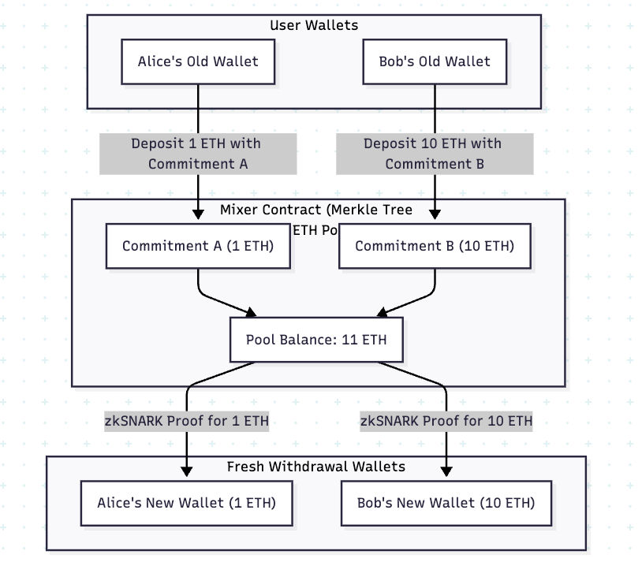
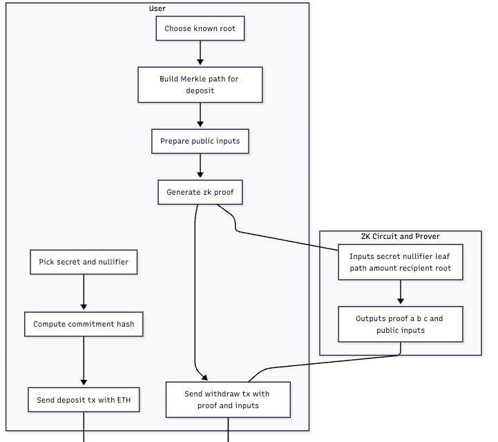
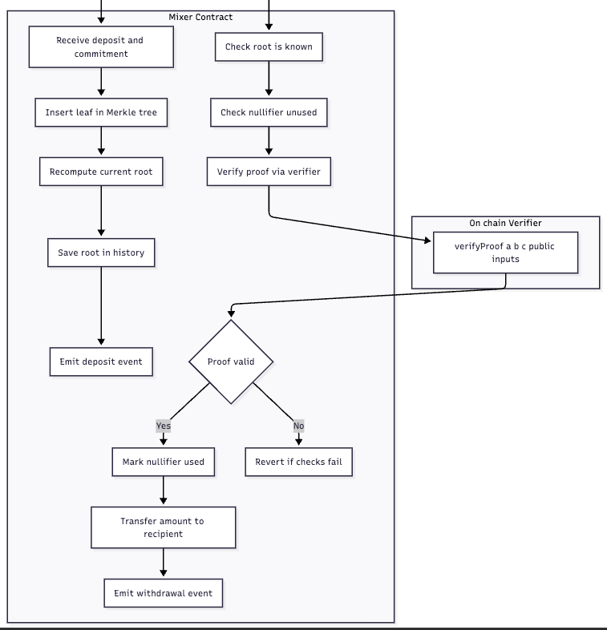

```
flowchart TD

    subgraph Wallets["User Wallets"]
        A1["Alice's Old Wallet"]
        B1["Bob's Old Wallet"]
    end

    subgraph Mixer["Mixer Contract (Merkle Tree & ETH Pool)"]
        C1["Commitment A (1 ETH)"]
        C2["Commitment B (10 ETH)"]
        Pool["Pool Balance: 11 ETH"]
    end

    subgraph NewWallets["Fresh Withdrawal Wallets"]
        A2["Alice's New Wallet (1 ETH)"]
        B2["Bob's New Wallet (10 ETH)"]
    end

    %% Deposits
    A1 -->|Deposit 1 ETH with Commitment A| C1
    B1 -->|Deposit 10 ETH with Commitment B| C2

    %% Pool collects ETH
    C1 --> Pool
    C2 --> Pool

    %% Withdrawals
    Pool -->|zkSNARK Proof for 1 ETH| A2
    Pool -->|zkSNARK Proof for 10 ETH| B2
```

